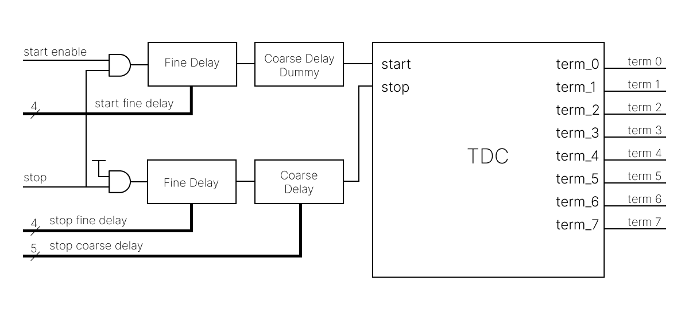
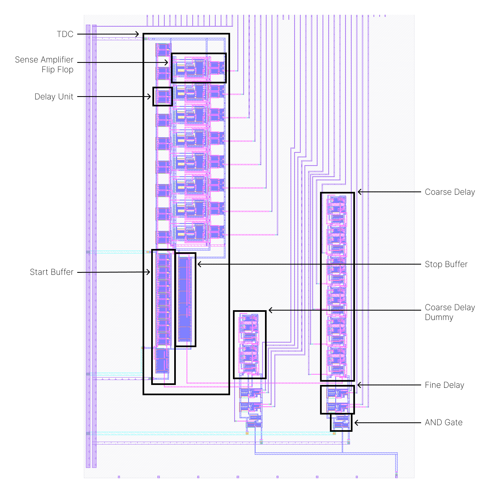

<!---

This file is used to generate your project datasheet. Please fill in the information below and delete any unused
sections.

You can also include images in this folder and reference them in the markdown. Each image must be less than
512 kb in size, and the combined size of all images must be less than 1 MB.
-->

## How it works

The circuit includes a time-to-digital converter (TDC) and a variable delay line. The circuit's output is the TDC's result, which consists of eight stages, producing eight outputs. This chip serves no practical purpose beyond testing the TDC circuit.

The TDC operates by utilizing flip-flops as time comparators and a delay line that generates delayed versions of the input start signal. It measures the phase difference between the start and stop signals by propagating the start signal through the delay line while using the stop signal as the clock for the flip-flops. The outputs of the flip-flops are high if the delayed start signal arrives before the stop signal and low if the delayed start signal arrives after the stop signal. By counting the number of high outputs, the phase difference between the start and stop signals can be determined with a resolution equal to one delay unit. Below is a diagram of a TDC with two stages.

The implemented TDC achieves a resolution of approximately 75 ps in post-layout simulations. Because it is challenging to provide external signals with phase differences as small as 75 ps, the circuit is designed to use a single input signal as both the start and stop signals. To test various outputs, the stop signal is delayed relative to the start signal. The architecture of the chip, featuring the TDC and the stop signal variable delay line, is shown below.

The chip layout is shown below, with boxed sections corresponding to the components in the architecture diagram.

To generate the TDC transfer curve, the start and stop signals were provided with varying phase differences. The simulation results for the TDC term_4 output are shown below. The term_4 output goes high when the phase difference between the signals is 377 ps.

Once the phase difference that triggers each TDC output is determined, a transfer curve can be plotted, as shown below.

The stop signal delay is implemented using a variable delay line comprising fine and coarse delay stages. The fine delay stage offers a step size of 25 ps, while the coarse delay stage provides a step size of 145 ps in post-layout simulations. Below are the simulation outputs for the coarse and fine delay stages. The delay line is configured using digital inputs. The start signal also has an associated delay line, but only with fine delay stages. This additional delay allows fine-grained control when the coarse delay steps are too large, enabling smaller phase differences between signals.

## How to test

The chip has one analog input, 14 digital inputs, and 8 digital outputs. To clear the TDC from a previous measurement, drive the start enable input low, and after a short delay, drive the stop input high. To test the TDC, vary the digital input values while applying a square wave to the analog stop signal.

The fine delay is controlled using thermometer encoding, while the coarse delay is controlled using one-hot encoding. An input of all zeros is valid for both encoding schemes.

## External hardware

Additional hardware, such as a Raspberry Pi (RPi) and a level shifter, is required to drive the analog and digital inputs.

