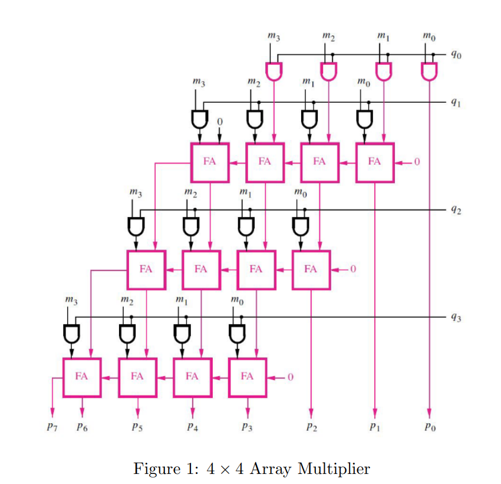

<!---

This file is used to generate your project datasheet. Please fill in the information below and delete any unused
sections.

You can also include images in this folder and reference them in the markdown. Each image must be less than
512 kb in size, and the combined size of all images must be less than 1 MB.
-->

## How it works

The project takes in two 4-bit numbers and performs multiplication to produce a product p. For each bit in the 4-bit inputs, the partial product was calculated by performing bitwise AND between the two inputs, resulting in 4 different partial products. Then the partial product would be shifted according to their multiplication process by shifting them in bits. Lastly, the partial products would be summed up to find the 8-bit product.

## How to test

We tested the code by creating a test bench giving it different inputs and the product it should get for each set of inputs after multiplication. If the result after running the code is the same as what was entered in the test bench, then the code would pass the test.

## External hardware

None