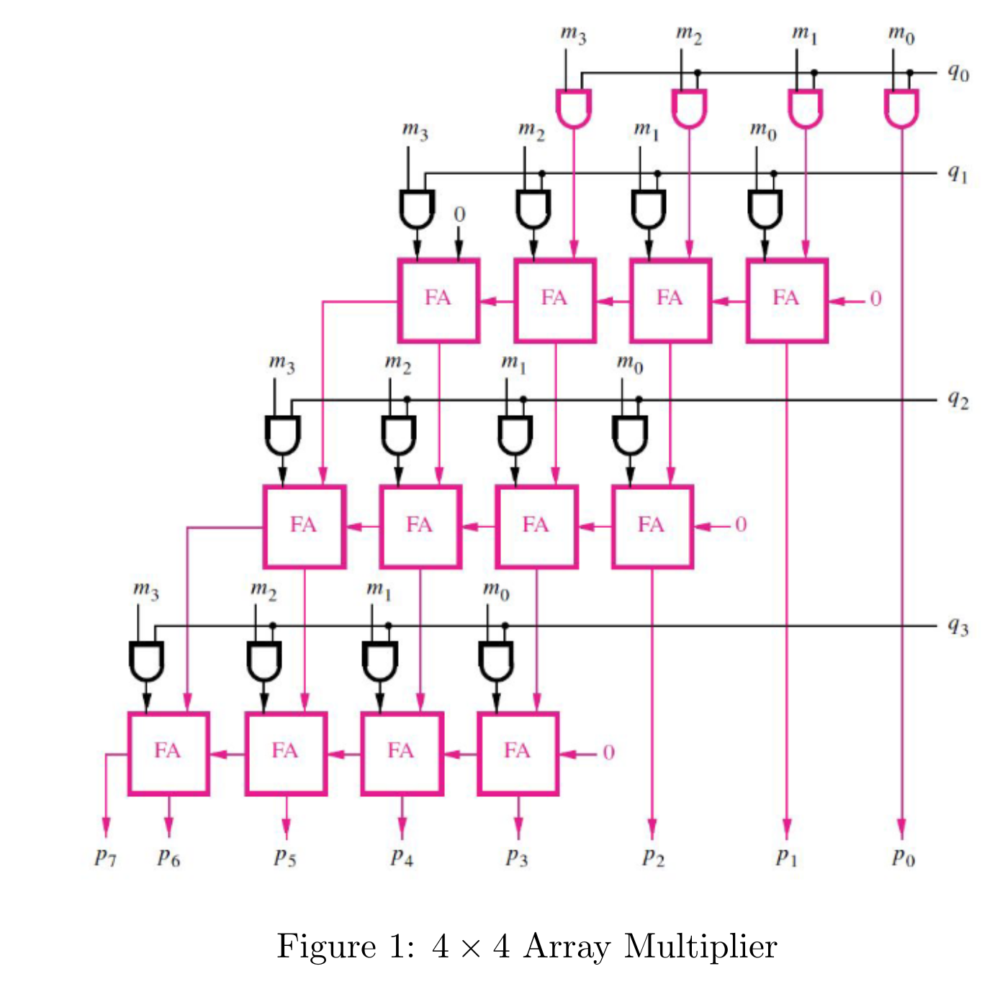

<!---

This file is used to generate your project datasheet. Please fill in the information below and delete any unused
sections.

You can also include images in this folder and reference them in the markdown. Each image must be less than
512 kb in size, and the combined size of all images must be less than 1 MB.
-->

## How it works

It accepts two 4-bit unsigned integer: m and q, and calculate the product, p.

## How to test

Provide several pairs of m and q (for example, (0, 1), (12, 13), (3, 4), (0, 0), (15, 15)). Then check whether the output is equal to the product of the two numbers.

## External hardware

List external hardware used in your project (e.g. PMOD, LED display, etc), if any