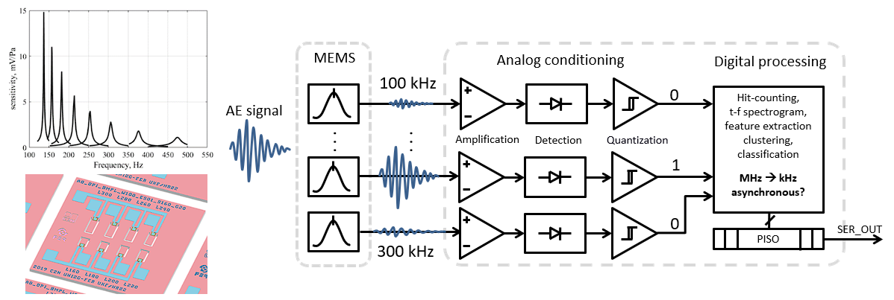
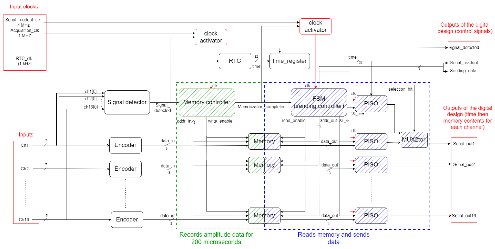

<!---

This file is used to generate your project datasheet. Please fill in the information below and delete any unused
sections.

You can also include images in this folder and reference them in the markdown. Each image must be less than
512 kb in size, and the combined size of all images must be less than 1 MB.
-->

## How it works

This is an early work-in progress test implementation of a digital readout, part of a low-power mixed-signal multichannel sensor interface for acoustic emission detection. The sensor interface is developed to support a passive, micromechanically-implemented ultrasonic signal frequency decomposition MEMS device, based on an array of piezoelectric micro-resonators: https://ieeexplore.ieee.org/document/9139151.

The digital part implemented here, performs real-time tracking of time-frequency spectrograms of individual  acoustic emissions. It is assumed that each input-channel represents a signal amplitude envelope of the associated frequency-component over time, digitized using a flash ADC. The analog part of the ADC is not implemented here. Each input channel is represented by 7 input lines per channel representing the thermometer code output of a flash ADC. This test design implements only two-channels. The amplitude of an signal envelope at each channel is decoded into 3-bit BCD code. Presence of an input signal at any channel (detector of acoustic emission start) initiates event-based 1 MHz sampling of the time-frequency amplitude spectrogram. The sampling lasts for 200 us. Once finished, the state machine controls reads-out the data stored. A double buffer composed of D-bistables is used to manage the storage and readout simultaneously. The stored data is sent serially for each channel. An RTC module is used to retrieve the time of the acoustic emission start.

This design is part of research activities https://www.fer.unizg.hr/liss/aemems. The design is generally applicable as a generic multi-channel time-series feature extraction block, and serve for subsequent clustering or classification, as part of an low-power MEMS-based sensor system-on-chip for acoustic event detection, or non-destructive testing. This is the first TinyTapeout submission of the design.

## How to test

Please contact authors for detailed instructions on how to set-up the design.

## External hardware

Logics analyzer will be useful for debugging.
