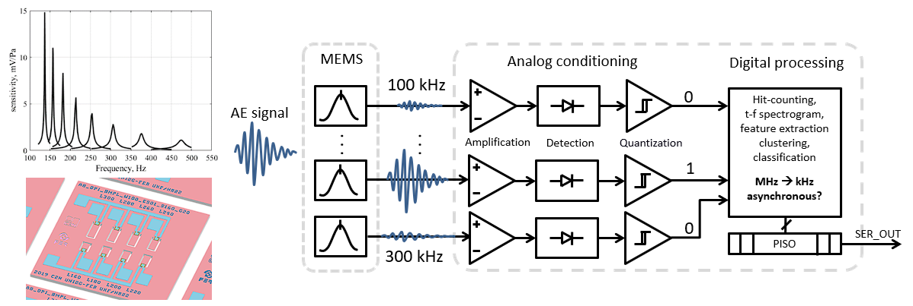
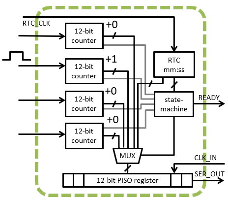

<!---

This file is used to generate your project datasheet. Please fill in the information below and delete any unused
sections.

You can also include images in this folder and reference them in the markdown. Each image must be less than
512 kb in size, and the combined size of all images must be less than 1 MB.
-->

## How it works

This is an early work-in progress test implementation of a digital readout, part of a low-power mixed-signal multichannel sensor interface for acoustic emission detection. The sensor interface is developed to support a passive, micromechanically-implemented ultrasonic signal frequency decomposition MEMS device, based on an array of piezoelectric micro-resonators: https://ieeexplore.ieee.org/document/9139151.

The digital readout part implemented here, tracks cumulative number of ultrasonic acoustic events/emissions occurences at each channel i.e. at the specific ultrasonic frequency, over a longer time interval. It is assumed that each acoustic emission event is represented by a short single digital input pulse. An analog conditioning circuit for pulse-shaping of input signals is not implemented here. The digital design consists of fifteen 12-bit channel-counters with overflow detection, a mm:ss real-time clock (RTC), a parallel-input-serial output (PISO) readout register, controlled by a readout state-machine. The counters store number of intermittently-occuring short digital input pulses, accumulated within the RTC's time-measurement interval 00:00 - 59:59, at each of the four input channels. Periodically, after every RTC overflow (1 h with assumed 1 Hz RTC input clock signal), the state-machine performs sequential serial readout of the RTC time and all channels, and resets all channel counters. Additionally, readout and individual channel reset is initiated by overflow at any of individual input channel counter. 

This design is part of research activities https://www.fer.unizg.hr/liss/aemems. The design is generally applicable for low-power wake-up sensor interfaces, acoustic event detection, non-destructive testing, particle-counters, or as a generic pulse-counting digital building block. This is the second TinyTapeout submission of the design. The first version was submitted to TT04, it featured 4 channels, and had timing issues during serial readout.

## How to test

Input signals are short rising-edge digital pulses, connected to input pins "channel 1" to "channel 15" . Output data becomes ready for serial readout at the output pin "serial_out" when overflow is signalled via the output "ready" pin ovf_global. Output bits are serially clocked-out using the input pin "clk". Specifically, RTC overflow is signalled via output pin "ovf_RTC_out", and overflow at an individual channel via the pin "ovf_ch_out". The rest of output pins are used for debugging of the state-machine's internal states.

## External hardware

Logics analyzer will come handy.
