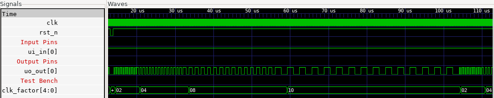
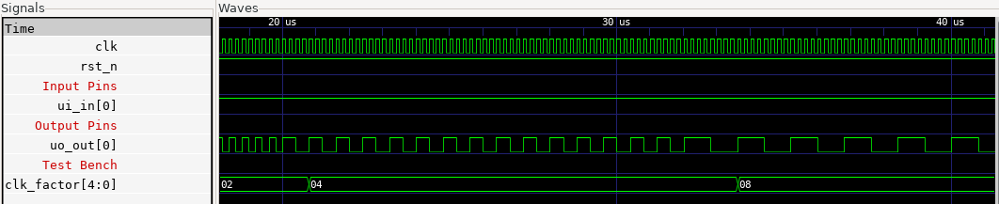
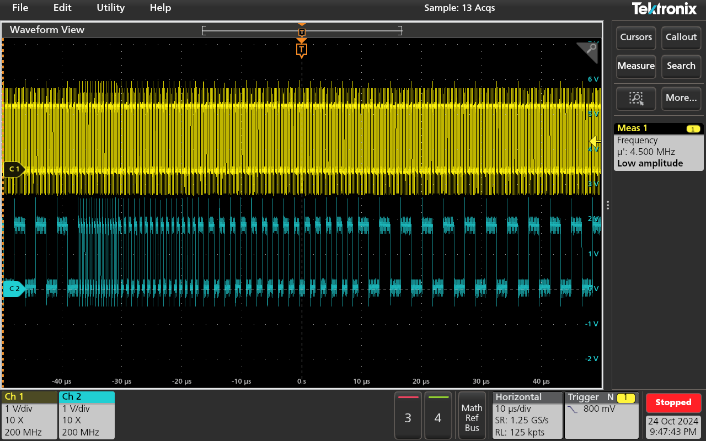
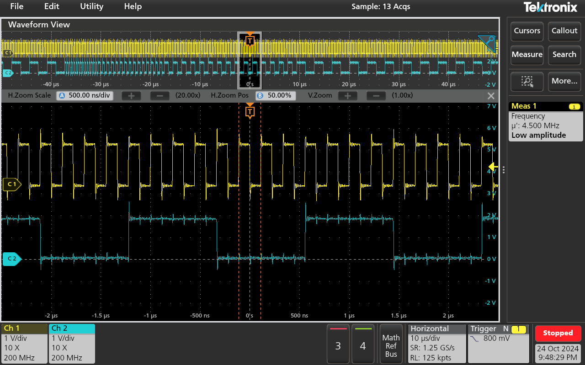

<!---

This file is used to generate your project datasheet. Please fill in the information below and delete any unused
sections.

You can also include images in this folder and reference them in the markdown. Each image must be less than
512 kb in size, and the combined size of all images must be less than 1 MB.
-->

## How it works

The project (src/project.v) implements a clock frequency sweeper in Verilog. It uses the Tiny Tapeout clock as input to generate a clock signal at the output uo[0] whose frequency is divided by 2 every 15 clock cycles. It goes from 1/2 to 1/16 of the input clock frequency and starts again. Input ui[0] is used as internal enable (active high).

## How to test

For simulation, use the test bench (test/tb.v), which includes a module (src/periodCount.v) for measuring the frequency (or period) ratio between input and output clocks. Use the Python script (test/test.py) if you want to perform unit tests using cocotb. For hardware testing, make sure the internal enable (input ui[0]) is high and check the output clock at output uo[0] using an oscilloscope.

### Gate level simulation (5 MHz input clock)

The frequency (or period) ratio between the input clock (clk) and the output clock (uo_out[0]) is given by clk_factor register of periodCount module:

Zoom in:

### Test using Tang Nano 9K FPGA (4.5 MHz input clock)

Input clock signal (yellow) and ouput clock signal (blue) acquired with an oscilloscope (analog inputs and passive probes):

Zoom in:

