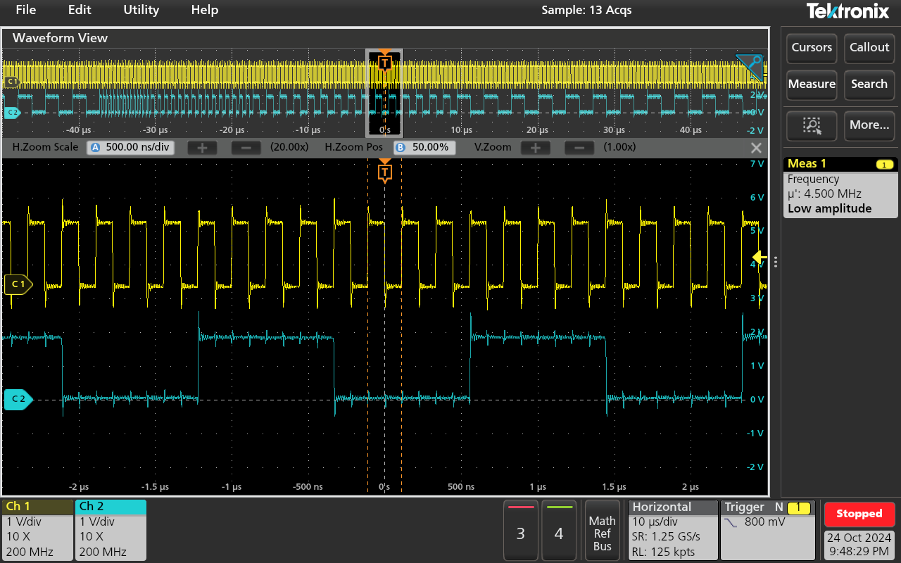

<!---

This file is used to generate your project datasheet. Please fill in the information below and delete any unused
sections.

You can also include images in this folder and reference them in the markdown. Each image must be less than
512 kb in size, and the combined size of all images must be less than 1 MB.
-->

## How it works

The project (src/project.v) implements a clock frequency sweeper in Verilog. It uses the Tiny Tapeout clock as input to generate a clock signal at the output uo[0] whose frequency is divided by 2 every 15 clock cycles. It goes from 1/2 to 1/16 of the input clock frequency and starts again. Input ui[0] is used as internal enable (active high).

## How to test

For simulation, use the test bench (test/tb.v), which includes a module (src/periodCount.v) for measuring the frequency (or period) ratio between input and output clocks. Use the Python script (test/test.py) if you want to perform unit tests using cocotb. For hardware testing, make sure the internal enable (input ui[0]) is high and check the output clock at output uo[0] using an oscilloscope.

### Gate level simulation (5 MHz input clock)

The frequency (or period) ratio between the input clock (clk) and the output clock (uo_out[0]) is given by clk_factor register of periodCount module:


Zoom in:


Unit tests:
```
(venv) jesus@ws131571:~/tt09-verilog-freqSweep/test$ make -B GATES=yes
rm -f results.xml
"make" -f Makefile results.xml
make[1]: Entering directory '/home/jesus/tt09-verilog-freqSweep/test'
mkdir -p sim_build/gl
/usr/bin/iverilog -o sim_build/gl/sim.vvp -D COCOTB_SIM=1 -s tb -g2012 -DGL_TEST -DFUNCTIONAL -DUSE_POWER_PINS -DSIM -DUNIT_DELAY=#1 -f sim_build/gl/cmds.f  /home/jesus/ttsetup/pdk/sky130A/libs.ref/sky130_fd_sc_hd/verilog/primitives.v /home/jesus/ttsetup/pdk/sky130A/libs.ref/sky130_fd_sc_hd/verilog/sky130_fd_sc_hd.v /home/jesus/tt09-verilog-freqSweep/test/gate_level_netlist.v /home/jesus/tt09-verilog-freqSweep/test/periodCount.v /home/jesus/tt09-verilog-freqSweep/test/tb.v
rm -f results.xml
MODULE=test TESTCASE= TOPLEVEL=tb TOPLEVEL_LANG=verilog \
         /usr/bin/vvp -M /home/jesus/ttsetup/venv/lib/python3.12/site-packages/cocotb/libs -m libcocotbvpi_icarus   sim_build/gl/sim.vvp
     -.--ns INFO     gpi                                ..mbed/gpi_embed.cpp:108  in set_program_name_in_venv        Using Python virtual environment interpreter at /home/jesus/ttsetup/venv/bin/python
     -.--ns INFO     gpi                                ../gpi/GpiCommon.cpp:101  in gpi_print_registered_impl       VPI registered
     0.00ns INFO     cocotb                             Running on Icarus Verilog version 12.0 (stable)
     0.00ns INFO     cocotb                             Running tests with cocotb v1.9.1 from /home/jesus/ttsetup/venv/lib/python3.12/site-packages/cocotb
     0.00ns INFO     cocotb                             Seeding Python random module with 1729775152
     0.00ns INFO     cocotb.regression                  Found test test.test_startup
     0.00ns INFO     cocotb.regression                  Found test test.test_reset
     0.00ns INFO     cocotb.regression                  Found test test.test_internal_enable
     0.00ns INFO     cocotb.regression                  Found test test.test_period_count
     0.00ns INFO     cocotb.regression                  running test_startup (1/4)
     0.00ns INFO     cocotb.tb                          Startup test with reset and internal enable
     0.00ns INFO     cocotb.tb                          rst_n = 0, ui_in[0] = 0
VCD info: dumpfile tb.vcd opened for output.
     2.00ns INFO     cocotb.tb                          uo_out[0] = 0
  2000.00ns INFO     cocotb.tb                          rst_n = 1, ui_in[0] = 0
  2202.00ns INFO     cocotb.tb                          uo_out[0] = 0
  4000.00ns INFO     cocotb.tb                          rst_n = 1, ui_in[0] = 1
  4202.00ns INFO     cocotb.tb                          uo_out[0] = 1
  4402.00ns INFO     cocotb.tb                          uo_out[0] = 0
  4402.00ns INFO     cocotb.tb                          Wait until 6 us
  6000.00ns INFO     cocotb.tb                          End of startup test
  6000.00ns INFO     cocotb.regression                  test_startup passed
  6000.00ns INFO     cocotb.regression                  running test_reset (2/4)
  6000.00ns INFO     cocotb.tb                          Reset test
  6000.00ns INFO     cocotb.tb                          rst_n = 0, ui_in[0] = 1
  6002.00ns INFO     cocotb.tb                          uo_out[0] = 0
  6002.00ns INFO     cocotb.tb                          clk_factor = 1
  6202.00ns INFO     cocotb.tb                          uo_out[0] = 0
  6202.00ns INFO     cocotb.tb                          clk_factor = 1
  8000.00ns INFO     cocotb.tb                          uo_out[0] = 0
  8000.00ns INFO     cocotb.tb                          clk_factor = 1
  8000.00ns INFO     cocotb.tb                          rst_n = 1, ui_in[0] = 1
  8202.00ns INFO     cocotb.tb                          uo_out[0] = 1
  8202.00ns INFO     cocotb.tb                          clk_factor = 1
  8402.00ns INFO     cocotb.tb                          uo_out[0] = 0
  8402.00ns INFO     cocotb.tb                          clk_factor = 1
  8402.00ns INFO     cocotb.tb                          Wait until 10 us
 10000.00ns INFO     cocotb.tb                          End of reset test
 10000.00ns INFO     cocotb.regression                  test_reset passed
 10000.00ns INFO     cocotb.regression                  running test_internal_enable (3/4)
 10000.00ns INFO     cocotb.tb                          Internal enable test
 10000.00ns INFO     cocotb.tb                          rst_n = 1, ui_in[0] = 0
 11600.00ns INFO     cocotb.tb                          rst_n = 1, ui_in[0] = 1
 11802.00ns INFO     cocotb.tb                          uo_out[0] = 1
 11802.00ns INFO     cocotb.tb                          clk_factor = 2
 11802.00ns INFO     cocotb.tb                          Wait until 13 us
 13000.00ns INFO     cocotb.tb                          Reset for 800 ns and wait 200 ns
 14000.00ns INFO     cocotb.tb                          End of internal enable test
 14000.00ns INFO     cocotb.regression                  test_internal_enable passed
 14000.00ns INFO     cocotb.regression                  running test_period_count (4/4)
 14000.00ns INFO     cocotb.tb                          Period count test
 14402.00ns INFO     cocotb.tb                          clk_factor = 2
 20802.00ns INFO     cocotb.tb                          clk_factor = 4
 33602.00ns INFO     cocotb.tb                          clk_factor = 8
 59202.00ns INFO     cocotb.tb                          clk_factor = 16
 59202.00ns INFO     cocotb.tb                          Wait until 200 us
200000.00ns INFO     cocotb.tb                          End of period count test
200000.00ns INFO     cocotb.regression                  test_period_count passed
200000.00ns INFO     cocotb.regression                  **************************************************************************************
                                                        ** TEST                          STATUS  SIM TIME (ns)  REAL TIME (s)  RATIO (ns/s) **
                                                        **************************************************************************************
                                                        ** test.test_startup              PASS        6000.00           0.02     362907.61  **
                                                        ** test.test_reset                PASS        4000.00           0.00     985504.01  **
                                                        ** test.test_internal_enable      PASS        4000.00           0.00    1009763.48  **
                                                        ** test.test_period_count         PASS      186000.00           0.11    1763647.26  **
                                                        **************************************************************************************
                                                        ** TESTS=4 PASS=4 FAIL=0 SKIP=0             200000.00           0.22     918687.40  **
                                                        **************************************************************************************

make[1]: Leaving directory '/home/jesus/tt09-verilog-freqSweep/test'
```

### Test using Tang Nano 9K FPGA (4.5 MHz input clock)

Input clock signal (yellow) and ouput clock signal (blue) acquired with an oscilloscope (analog inputs and passive probes):


Zoom in:



## External hardware

No external hardware is needed.
