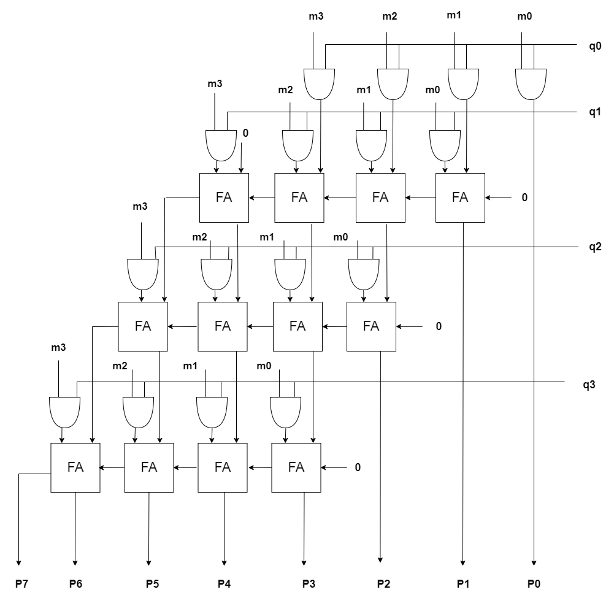

<!---

This file is used to generate your project datasheet. Please fill in the information below and delete any unused
sections.

You can also include images in this folder and reference them in the markdown. Each image must be less than
512 kb in size and the combined size of all images must be less than 1 MB.
-->

## How it works
When multiplying two 4-bit numbers, `m = 1011` (11 in decimal) and `q = 1101` (13 in decimal), the multiplier first generates partial products (`m0`, `m1`, `m2`, and `m3`) by AND-ing each bit of `q` with all bits of `m`. For instance, `m0` results from `q[0] & m`, producing `1101`, and similarly, `m2` and `m3` are also `1101`, while `m1` is `0000` since `q[1]` is zero. These partial products are then summed column-wise using full adders, combining overlapping bits and propagating carries. For example, in the first column, `p[0]` is directly assigned from `m0[0]`, which is `1`. Moving to the second column, we add `m0[1]` and `m1[0]` with any carry (which is zero in this case), giving a sum of `1` and a carry of zero, resulting in `p[1] = 1`. In the third column, adding `m0[2]`, `m1[1]`, and the carry results in a sum of `0` and a carry of zero, making `p[2] = 0`. In the fourth column, adding `m0[3]` and `m1[2]` with zero carry gives a sum of `1` and no carry, so `p[3] = 1`. Continuing this process for all columns and partial products, the final 8-bit product `p` is formed as `10011111` (143 in decimal), representing the correct product of 11 and 13.

## How to test
The Cocotb testbench for your project sets up a clock running at 100 KHz and initializes the design by asserting and de-asserting a reset signal (`rst_n`). It tests our Verilog module by setting various input values (`ui_in`, `uio_in`) and checking the resulting output (`uo_out`) using assertions to ensure correctness. For each test case, like **Test Case 3**, the test sets specific input values (e.g., `0x2_6`), waits for one clock cycle to allow the inputs to propagate through the design, and verifies that the output matches an expected value (in this case, `12`). This structured approach allows us to efficiently validate the behavior of our module for different input scenarios and edge cases.

## External hardware
N/A
List external hardware used in your project (e.g. PMOD, LED display, etc), if any
