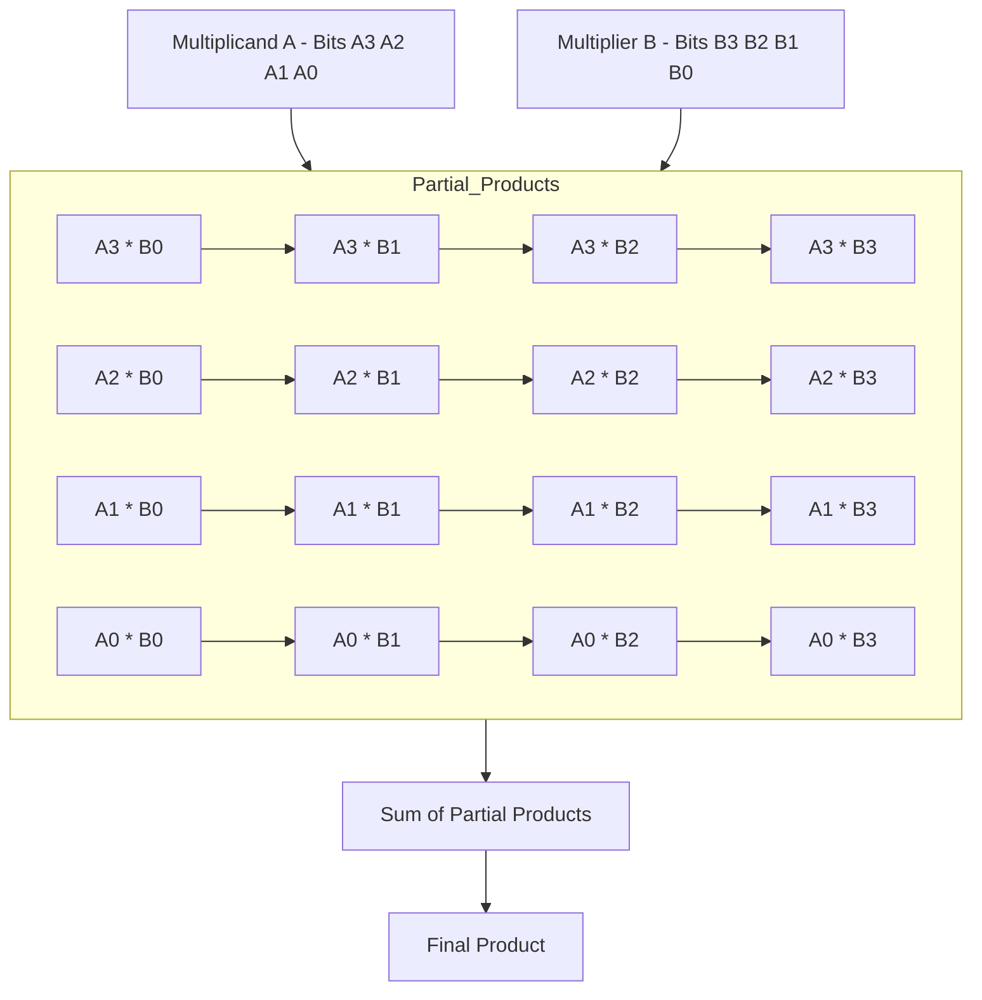

<!---

This file is used to generate your project datasheet. Please fill in the information below and delete any unused
sections.

You can also include images in this folder and reference them in the markdown. Each image must be less than
512 kb in size, and the combined size of all images must be less than 1 MB.
-->

<!---

This file is used to generate your project datasheet. Please fill in the information below and delete any unused
sections.

You can also include images in this folder and reference them in the markdown. Each image must be less than
512 kb in size, and the combined size of all images must be less than 1 MB.
-->

## How it works

An array multiplier is a combinational circuit that performs binary multiplication by generating and summing partial products. Here’s how a 4x4 array multiplier operates:

1. **Binary Multiplicand and Multiplier**: A 4x4 multiplier takes two 4-bit binary numbers (e.g., \( A = A_3 A_2 A_1 A_0 \) and \( B = B_3 B_2 B_1 B_0 \)) as inputs. Each bit in \( A \) is multiplied by each bit in \( B \), creating 16 partial products.

2. **Partial Product Generation**: Each bit in \( A \) is ANDed with each bit in \( B \), forming a matrix of partial products. For instance, if \( A = 1011 \) and \( B = 1101 \), then \( A_3 \times B_3 \), \( A_3 \times B_2 \), and so forth are calculated.

3. **Shifting and Summing**: Each row of partial products corresponds to a shifted version based on the position of the bits in \( B \). For example, the row generated by \( A_3 \) will be shifted three places to the left. 

4. **Adding Partial Products**: The shifted partial products are summed column by column, similar to traditional addition in binary, often using full adders or half adders.

5. **Final Product**: The result is an 8-bit product that represents the multiplication of the two 4-bit inputs.

Here's a visual representation of how an array multiplier works:

## How to test

To test the array multiplier:

1. Set up the multiplier by providing binary inputs for both the multiplicand (A) and the multiplier (B).
2. Run the simulation or test in hardware to verify that each partial product is calculated correctly.
3. Ensure that the partial products are properly shifted and summed to produce the final product.
4. Compare the final output with the expected result from standard binary multiplication to confirm accuracy.

## External hardware

No external hardware is required for this project. The array multiplier can be tested within a simulation environment or with an FPGA setup if hardware verification is needed.
