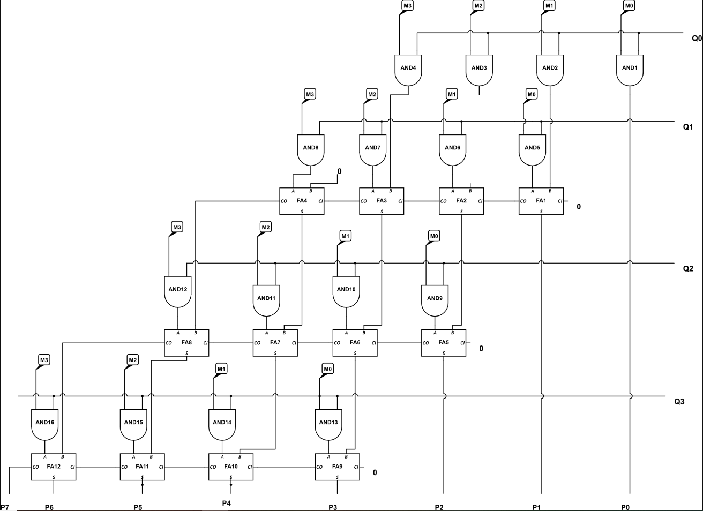

<!---

This file is used to generate your project datasheet. Please fill in the information below and delete any unused
sections.

You can also include images in this folder and reference them in the markdown. Each image must be less than
512 kb in size, and the combined size of all images must be less than 1 MB.
-->

## How it works

The `tt_um_array_mult_structural` module performs 4x4 unsigned multiplication 
by using bitwise multiplication and a series of Carry-Save Adders (CSAs) followed by a final Carry-Propagate Adder (CPA). 
It takes an 8-bit input (`ui_in`) divided into two 4-bit operands: 
`m = ui_in[7:4]` and `q = ui_in[3:0]`. 
Each bit of `m` is multiplied with each bit of `q`, generating partial products. 
These partial products are accumulated row by row using full adders, 
with the carry propagated through successive rows. 
The final product, `p`, is composed from the sum and carry values of the last rows and is assigned to the 8-bit output (`uo_out`).

## How to test

To test the module, you can create a Verilog testbench that applies different 8-bit input values for `ui_in` representing 
two 4-bit numbers and observes the resulting 8-bit output `uo_out`. 
For example, inputting `ui_in = 8'b0011_0011` (3 * 3) should yield `uo_out = 8'b0000_1001` (9). 
By applying various combinations of operands, 
such as `ui_in = 8'b1111_1111` (15 * 15), and using a simulation tool to verify the waveforms, you can ensure that the design correctly 
computes the products and functions as expected.

## External hardware

N/A
