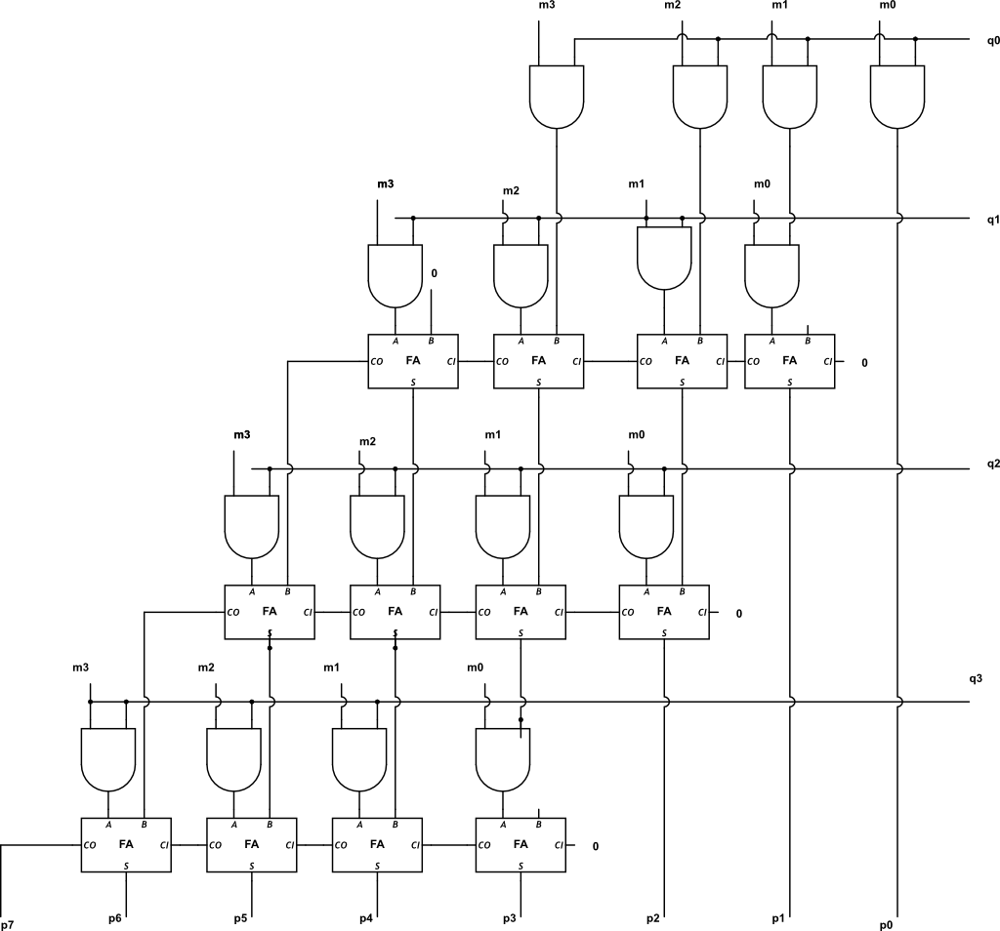

<!---

This file is used to generate your project datasheet. Please fill in the information below and delete any unused
sections.

You can also include images in this folder and reference them in the markdown. Each image must be less than
512 kb in size, and the combined size of all images must be less than 1 MB.
-->

## How it works

Our 4x4 array multiplier multiplies two 4-bit binary numbers to produce an 8-bit product by breaking down the process into partial products. Each bit of one input is ANDed with each bit of the other input, creating a 4x4 grid of partial products. These partial products are organized into rows and shifted leftward, simulating the alignment process in traditional multiplication. Full adders within each “box” of the grid add these partial products, managing both the sum and the carry bits. Each carry moves to the next box, allowing us to systematically add all rows and carry values. Once all additions are complete, the result is an accurate 8-bit binary product of the two inputs. A block diagram is also included to illustrate the structure of partial products, adders, and carry management within the multiplier.

## How to test

Testing the 4x4 array multiplier is handled with a Verilog testbench that instantiates the module, wiring inputs and outputs, along with a Python script for validation. The Python script applies specific input values, then checks output correctness using assertions to verify expected multiplication results. For each test, values are set for the inputs, clock cycles are awaited, and the output is asserted to match the expected product, making it easy to identify any errors. 

## External hardware

N/A
