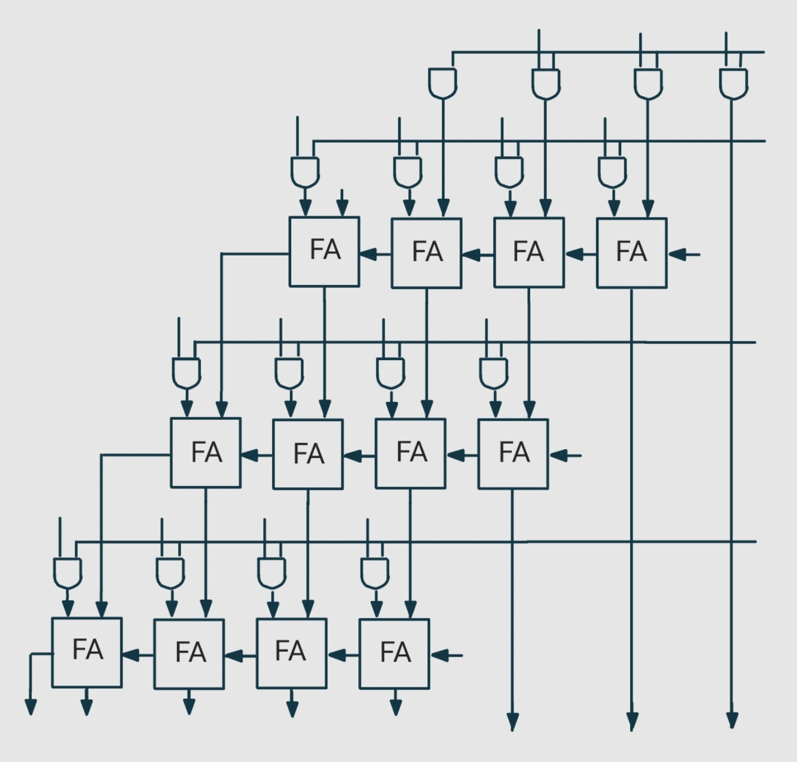

<!---

This file is used to generate your project datasheet. Please fill in the information below and delete any unused
sections.

You can also include images in this folder and reference them in the markdown. Each image must be less than
512 kb in size, and the combined size of all images must be less than 1 MB.
-->

## How it works

This project implements a **4-bit array multiplier** using structural Verilog. It takes two 4-bit binary inputs (`m` and `q`) and computes their product, outputting the result as an 8-bit binary number. The multiplication is performed using an array multiplier architecture, which generates partial products for each bit of the inputs and sums them using a series of adders.

Partial products are calculated based on the bits of each 4-bit input. The summation of partial products is arranged in stages, and the final result is accumulated through these stages, producing an 8-bit result (`uo_out[7:0]`).

## How to test

1. **Input Setup**: Connect the first 4-bit input `m` through `ui_in[3:0]` and the second 4-bit input `q` through `uio_in[3:0]`.
2. **Observing Output**: The 8-bit product of `m` and `q` will be output on `uo_out[7:0]`.
3. **Clock and Reset**: Although there are `clk` and `rst_n` signals in the design, they are not utilized in this version of the array multiplier, which operates as a combinational circuit.

### Example Test Case

- **Inputs**: Set `m` to `4'b0011` (decimal 3) and `q` to `4'b0010` (decimal 2).
- **Expected Output**: `uo_out` should be `8'b00000110` (decimal 6).

Testing can be performed on a simulation platform (such as Verilog testbenches in ModelSim or other simulation tools) by assigning values to `ui_in` and `uio_in` and verifying the `uo_out` output.

## External hardware

This project does not require any external hardware. All inputs and outputs are managed internally within the module, which can be tested in simulation environments or FPGA-based hardware setups.

## Circuit Diagram

