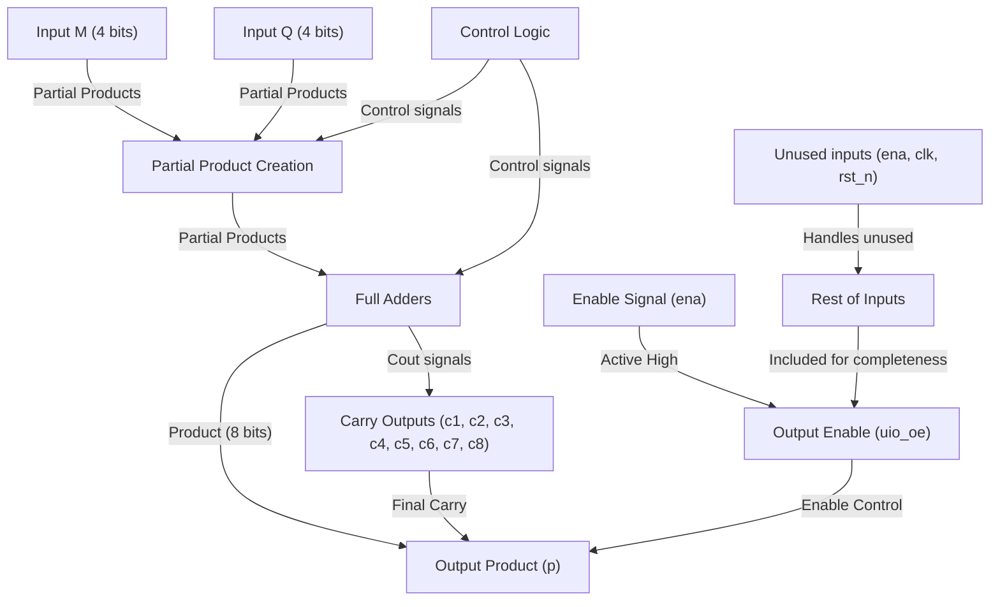
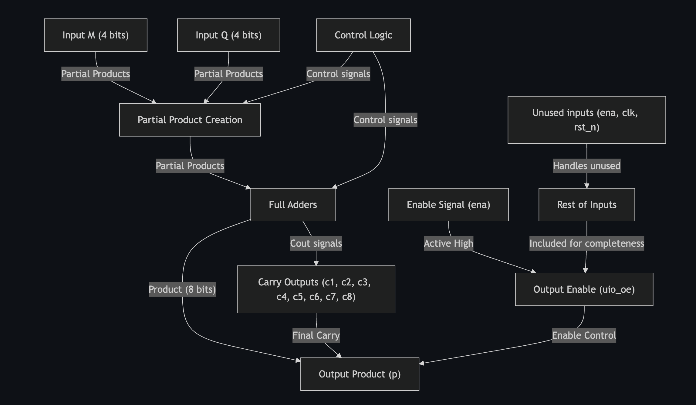

<!---

This file is used to generate your project datasheet. Please fill in the information below and delete any unused
sections.

You can also include images in this folder and reference them in the markdown. Each image must be less than
512 kb in size, and the combined size of all images must be less than 1 MB.
-->

## How it works

Explain how an array multiplier works, as well as partial products:

An array multiplier is a combinational circuit that multiplies two binary numbers together. The partial products are generated for each bit of the second operand and then adding them together using full adders. 
Each bit of the multiplier, in this case Q, produces partial products by using an AND-gate with every bit of M. Since this is a 4x4 multiplier, there will be 4 rows of 4-bit partial products.
The partial products are then added together using full adders, with carry bits being moved to the next column as needed.

## Block diagram

## Block diagram PDF

## How to test

Explain how you know that your hardware is working when you get it:

There are numerous ways of testing the hardware. One method is to use a simulation window with a provided testbench to verify that the output matches the inputs for each of the test cases. In this scenario, we have five separate test cases to ensure the hardware functions as needed. A separate check for minimum and maximum values to guarantee correct carry propagation is also required to ensure proper functionality.

## External hardware

List external hardware used in your project (e.g. PMOD, LED display, etc), if any:

No external hardware was used in this project. The design functions purely on the FPGA.
