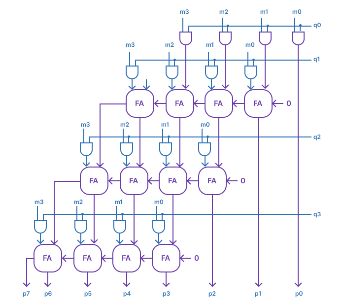

<!---

This file is used to generate your project datasheet. Please fill in the information below and delete any unused
sections.

You can also include images in this folder and reference them in the markdown. Each image must be less than
512 kb in size, and the combined size of all images must be less than 1 MB.
-->

## How it works

Our implementation of the multiplier took in two 4-inputs, m and q, and produced an 8-bit output, p, representing their product. We then genereated partial products by ANDing each bit of m with all bits of q and used a series of full adders, to sum these partial products. Each adder handled the addition of bits and carry-out/carry-in signals from the previous stage, ensuring proper alignment of the products. 

## How to test

We parse in an 8-bit value which is split into 2 4-bit values to generate m(bits 8 to 5), and q(bits 4 to 1). These two values are then multiplied to produce our product p. 

## External hardware
N/A
