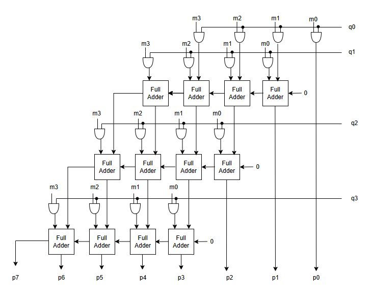

<!---

This file is used to generate your project datasheet. Please fill in the information below and delete any unused
sections.

You can also include images in this folder and reference them in the markdown. Each image must be less than
512 kb in size, and the combined size of all images must be less than 1 MB.
-->

## How it works

The structural 4 by 4 binary array multiplier generates four partial products by ANDing each bit of one 4-bit input with each bit of the other. Each partial product is then shifted according to its significance (based on bit position). The shifted rows are summed using binary adders, yielding an 8-bit product. This structured approach is called an array multiplier.

## How to test

To test a 4x4 binary multiplier, apply a set of 4-bit input pairs, covering typical, edge, and corner cases. For each pair, verify that the output matches the expected 8-bit product. Automate tests to check all possible inputs (total of 256 combinations) if feasible, or focus on key cases to ensure accuracy and catch potential design errors.

## External hardware

N/A

