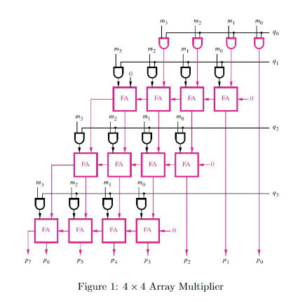

<!---

This file is used to generate your project datasheet. Please fill in the information below and delete any unused
sections.

You can also include images in this folder and reference them in the markdown. Each image must be less than
512 kb in size, and the combined size of all images must be less than 1 MB.
-->

## How it works

4x4 multiplier using structural verilog. The structure of the 4x4 multiplier array that the exercise should emulate is shown below in the diagram. This multiplies two 4-bit inputs, ‘m’ and ‘q’ in this case, to an 8-bit product, ‘p’. The code takes each consecutive bit of q and cascades it along the first bit of m. From there, full adders are used to combine each bit's value. 

## How to test

Test cases for inputs m and q should result in the expected product value of p. The test cases in the test python compilation essentially declare two values that should be multiplied and the predicted correct output of the multiplication. To test the functionality, access the test/README.md file.

## External hardware

N/A
