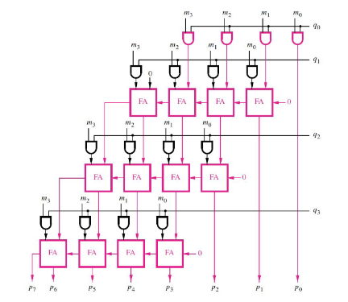

<!---

This file is used to generate your project datasheet. Please fill in the information below and delete any unused
sections.

You can also include images in this folder and reference them in the markdown. Each image must be less than
512 kb in size, and the combined size of all images must be less than 1 MB.
-->

## How it works

It works by multiplying two 4-bit binary numbers using full adders and outputing the product.

## How to test

To test, you open the test.py file and input two 4-bit binary numbers. The first 4 are the first number and
the last 4 are the second number. The expected value should be the product of the two numbers. 

## External hardware

None
