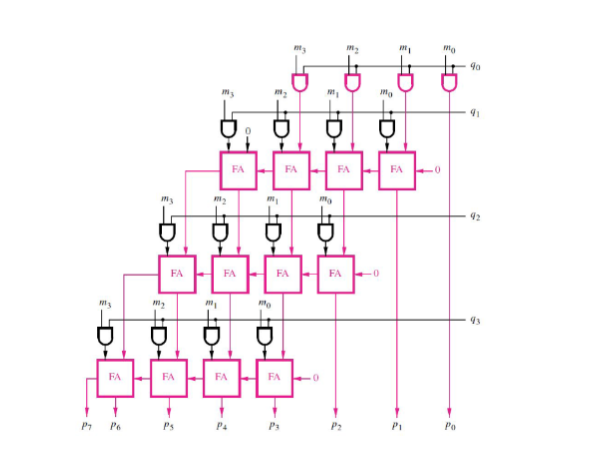

<!---

This file is used to generate your project datasheet. Please fill in the information below and delete any unused
sections.

You can also include images in this folder and reference them in the markdown. Each image must be less than
512 kb in size, and the combined size of all images must be less than 1 MB.
-->

## How it works
implements a 4x4 array multiplier, as shown in the schematic below

## How to test

follow test/README.md

use test/test.py to add test cases

## External hardware

None
