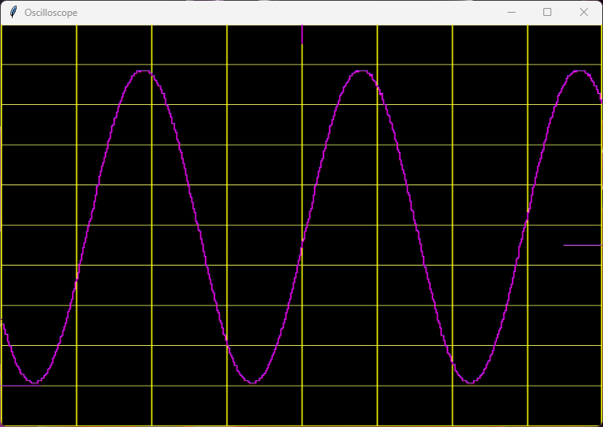

<!---

This file is used to generate your project datasheet. Please fill in the information below and delete any unused
sections.

You can also include images in this folder and reference them in the markdown. Each image must be less than
512 kb in size, and the combined size of all images must be less than 1 MB.
-->

**Authors:** [Pascal Gesell](https://github.com/gfcwfzkm), [Dr. Torsten Maehne](https://www.bfh.ch/en/torsten-maehne), [Dr. Theo Kluter](https://www.bfh.ch/en/theo-kluter)

## How it works

This is a basic oscilloscope design using the experimental VHDL template. It samples the input signal from channel 1 of an ADC Pmod (Digilent PmodAD1) and buffers the samples on an external FRAM. The captured signal is output on screen via a BlackMesa HDMI Pmod. Test signals are generated using Direct Digital Synthesis and are output on channel 1 of the DAC Pmod (Digilent PmodDA2). Four buttons and two switches allow to control the oscilloscope and choose the test signal to generate.

When the trigger button is pressed, a single-shot measurement is taken when the trigger criteria is met. The trigger criteria can be the vertical and horizontal position as well as the trigger level (positive edge or negative edge). The data is buffered onto the external FRAM, with the goal to contain 32k samples before the trigger event and 32k samples after the trigger event. After the data is collected, the data is displayed on the HDMI screen.

Since an external FRAM memory is used with no buffers on the chip, the displayed oscilloscope screen is actually rotated by 90° to the right. Thus only one sample needs to be read from the FRAM per output video line. A [Python script](show_scope.py) is provided for convenience to read the video frames captured by an USB HDMI video grabber, rotate them by 90° to the left and display them on the screen.

The signal generator supports a few basic waveforms: sine, square, triangle and sawtooth. The frequency and amplitude can be adjusted using the buttons and switches. The signal generator is also used to test the trigger functionality and the display of the oscilloscope.

The scope settings are continuously output via UART at 9600 baud (8N1) on `uo_out(3)`.

## How to test

Connect the various Pmods to the TinyTapeout 4+ demo board or FPGA board according to the [pinout description in the info.yaml file](../info.yaml). Connect the output of the DAC to the input of the ADC and connect the HDMI Pmod to a screen or HDMI capture card. Run the trigger to capture a single-shot measurement and display the data on the screen.

## External hardware

To test and use this project, you will need the following hardware:
 - [1 ⨉ BlackMesaLabs 3-bit HDMI Pmod](https://blackmesalabs.wordpress.com/2017/12/15/bml-hdmi-video-for-fpgas-over-pmod/) : A 3-bit HDMI Pmod
 - [1 ⨉ Digilent PmodAD1](https://digilent.com/reference/pmod/pmodad1/start) : A 12-bit ADC Pmod
 - [1 ⨉ Digilent PmodDA2](https://digilent.com/reference/pmod/pmodda2/start) : A 12-bit DAC Pmod
 - [1 ⨉ FM25W256G](https://datasheet.octopart.com/FM25W256-G-Cypress-Semiconductor-datasheet-86779777.pdf) : 32k x 8 FRAM Pmod 
 - [1 ⨉ Digilent PmodBTN](https://digilent.com/reference/pmod/pmodbtn/start) : A 4 Buttons Pmod
 - [1 ⨉ Digilent PmodSWT](https://digilent.com/reference/pmod/pmodswt/start) : A 4 Switches Pmod, of which only 2 are used
 - Optionally, an HDMI capture card to display the HDMI output on a computer screen

 **Attention:** The above Pmods cannot be directly connected to the [TinyTapeout 4+ demo board](https://github.com/TinyTapeout/tt-demo-pcb)! The Pmods' pins need to be individually connected to the right Pmod pins of the TinyTapeout 4+ demo board, as documented in the IO section.

 ## FPGA Implementation

 The design has been implemented and tested on a Sipeed Tang Nano 9k FPGA board using [my own base PCB](https://github.com/gfcwfzkm/t9k-baseboard) to have enough available Pmods to test the design.

## Acknowledgements

This work was realized under the supervision of Dr. Torsten Maehne and Dr. Theo Kluter as part of my project work in the 5th term of my [Bachelor studies of electrical engineering and information technology](https://bfh.ch/electrical) at [Berner Fachhochschule (BFH)](https://www.bfh.ch/ti/en), Biel/Bienne, Switzerland.
