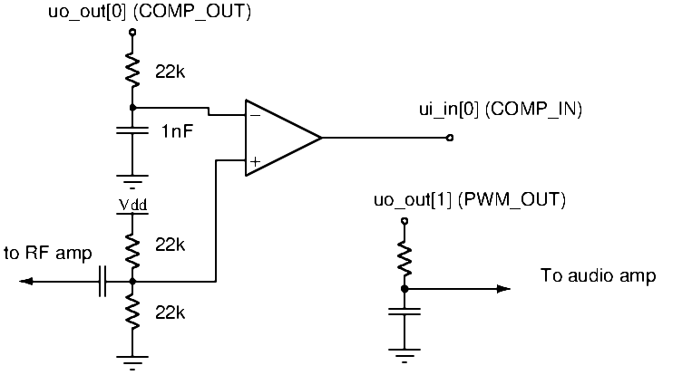

<!---

This file is used to generate your project datasheet. Please fill in the information below and delete any unused
sections.

You can also include images in this folder and reference them in the markdown. Each image must be less than
512 kb in size, and the combined size of all images must be less than 1 MB.
-->

## How it works

This project is a Software Defined Radio pipeline for AM radio reception written in verilog. It works using an external comparator as a 1-bit ADC frontend which is oversampled and decimated 4096 times to give an extra 6 bits of precision. It is based on this Hackaday Project: [https://hackaday.io/project/170916-fpga-3-r-1-c-mw-and-sw-sdr-receiver](https://hackaday.io/project/170916-fpga-3-r-1-c-mw-and-sw-sdr-receiver) by Alberto Garlassi. 

Although this is a fully digital core, but there are plans to make an analog frontend circuit as an analog design in future Tiny Tapeouts, so both designs would be hooked up together to create a radio with few external components.

Also, this core is very big - 3x2 Tiny Tapeout tiles (@ 64% utilisation). An area of future development could be to simplify the demodulation pipeline to reduce gate count.

## How to test

You need to connect an external comparator and RC network. You will probably need a simple RF amplifier as well. See below for more information.

The core has a SPI interface for setting the demodulation frequency and gain. It consists of a single
32-bit shift register. It has the following format:-

| Bits 31 - 30| Bits 29 - 26 | Bits 25 - 0     |
|-------------|--------------|-----------------|
|    Unused   |   Gain       |  NCO Phase incr.|

The gain can take on the following values:

|  "Gain" value| Actual Gain|
|--------------|------------|
|     0        |   x1       |
|     1        |   x2       |
|     2        |   x4       |
|     3        |   x8       |
|     4        |   x16      |
|     5 - 7    |   x32      |

If the gain is set too high, the demodulated signal will wrap and sound distorted, so adjust the gain down to the minimum needed to hear the station clearly.

The "NCO Phase increment" is the value that is added to the NCO phase every clock cycle. Use the following python code to calculate the value to write, based on the desired carrier frequency:

    hex(int((1<<26) * <carrier frequency> / <chip clock frequency>))

E.g., for 936kHz (ABC Radio national Hobart) at 50MHz clock frequency, it would be:

    > hex(int((1<<26) * 936000 / 50000000))
    '0x132b55'

## External hardware

- External comparator
- Resistor bias network
- RC network
- External SPI microcontroller to set station
- RF amplifier

