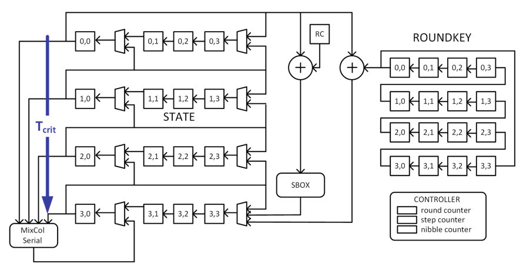

<!---

This file is used to generate your project datasheet. Please fill in the information below and delete any unused
sections.

You can also include images in this folder and reference them in the markdown. Each image must be less than
512 kb in size, and the combined size of all images must be less than 1 MB.
-->

## How it works

tt09-led-serial is a nibble-serial implementation of the LED block cipher, proposed in 2012 and defined in [The LED Block Cipher](https://eprint.iacr.org/2012/600.pdf) by J. Guo et. al. The cipher encrypts a 64-bit block of plaintext with a 128-bit key into a 64-bit block of ciphertext. The nibble-serial implementation enables a very compact implementation as most of the datapath logic can be reused over each nibble. The downside is that such nibble-serial implementations have a much larger latency. The nibble-serial architecture shown below was presented and analyzed earlier in [Differential Fault Intensity Analysis on PRESENT and LED Block Ciphers](https://link.springer.com/chapter/10.1007/978-3-319-21476-4_12) by N. F. Galathy et. al.

To further reduce the I/O pinout constraints, this design also serializes the data-input (64 bit plaintext and 128 bit key) as well as the data-output (64 bit ciphertext). 

| Activity        | Cycles               |
|-----------------|----------------------|
| Load Plaintext  | 64                   |
| Load Key        | 128                  |
| Read Ciphertext | 64                   |
| Encrypt         | 2045                 |

The module is controlled through the bits of the input word ui_in.
The serial data format is MSB to LSB. That is, given a block of plaintext `0x0123...`, the bits would be shift in as in the bitstring `0b0000000100100011....`

| Bit             | Name     |  Function                             |
|-----------------|----------|---------------------------------------|
| 7-6             | unused   | NA                                    |
| 5               | start    | Assert to start encryption            |
| 4               | getct    | Assert to shift out ciphertext bit    |
| 3               | loadkey  | Assert to shift in key bit            |
| 2               | loadpt   | Assert to shift in plaintext bit      |
| 1               | keyi     | Key input bit                         |
| 0               | datai    | Plaintext input bit                   |

The results are generation on the output word uo_out.

| Bit             | Name     |  Function                             |
|-----------------|----------|---------------------------------------|
| 7-2             | unused   | NA                                    |
| 1               | done     | 1 indicates encryption complete       |
| 0               | dataq    | Ciphertext output bit                 |

## LIMITATIONS

This design forces the key bits to 0 upon loading, so that the effective key value of the cipher is always hardcoded to 00000000_00000000_00000000_00000000. This disables the use of the design as a cipher, yet it still demonstrates how a nibble-serial architecture can be designed.

## How to test

This block could be tested with some integration on a Raspberry PI to control ui_in and uo_out.
The typical sequence of operation is as follows.

1. Wait until done == 1, which indicates that the cipher is idle
2. Assert loadkey, and shift in key bits. Repeat 128 times. De-assert loadkey.
3. Assert loadpt, and shift in plaintext bits. Repeat 64 times. De-assert loadpt.
4. Assert start for one clock cycle.
5. Wait until done == 1.
6. Assert getct and shift out ciphertext bits. Repeat 64 times. De-assert getct.

Here are twotthree sample test vectors. Consult the testbench for additional test vectors.

| Plaintext           |              Key                           | Ciphertext              |
|---------------------|--------------------------------------------|-------------------------|
|  0000000000000000   |  00000000000000000000000000000000          | 3decb2a0850cdba1        |
|  0123456789abcdef   | 00000000000000000000000000000000           | da261393c73be9ce        |
|  12153524c0895e81   | 00000000000000000000000000000000           | 29db5fe262572f4e        |

## External hardware

You will need external hardware to use the block cipher.
