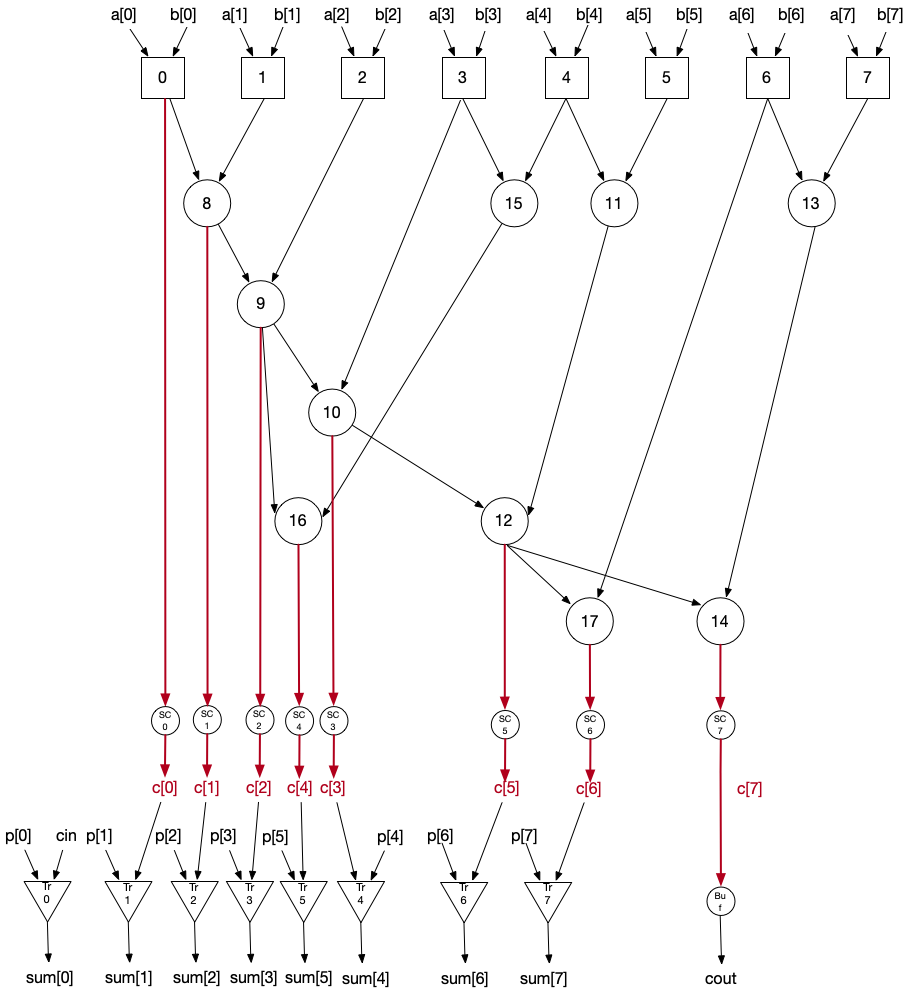

<!---

This file is used to generate your project datasheet. Please fill in the information below and delete any unused
sections.

You can also include images in this folder and reference them in the markdown. Each image must be less than
512 kb in size, and the combined size of all images must be less than 1 MB.
-->

## How it works

LLM-aided design of a totally-new 8-bit prefix network-based high speed adder:

In this figure, the squares represent the Square module in project.v, the circles represent the BigCircle module in project.v, the small circles represent the SmallCircle in project.v, and the triangles represent the Triangle module in project.v. Each carry signal (c[i]) is generated by circles and each sum signal (sum[i]) is generated by triangles.

## How to test

This test systematically applies all combinations of 8-bit values to dut.a and dut.b, verifies the resulting sum dut.sum against the expected 8-bit result ((dut.a + dut.b) & 0xFF), and asserts that the dut behaves correctly.

## External hardware

No external hardware
