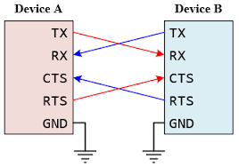
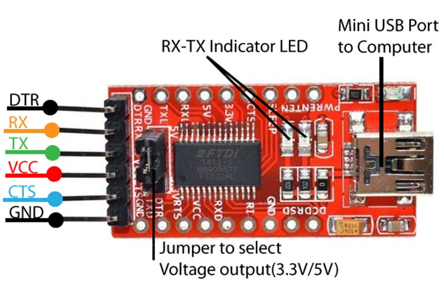

<!---

This file is used to generate your project datasheet. Please fill in the information below and delete any unused
sections.

You can also include images in this folder and reference them in the markdown. Each image must be less than
512 kb in size, and the combined size of all images must be less than 1 MB.
-->

## How it works

This project is a UART module that includes FIFO buffers to store bytes of data. The module has standard UART input and output pins, such as ``rx``, ``tx``, ``cts``, and ``rts``. Additional inputs allow the configuration of operation mode(s): **Idle**, **RX**, **TX** or **Buffer Clear**, and desired baud rate is user-configurable through the ``Control`` pins. Bidirectional data pins are used to send and receive test data. Additional outputs include an ``error`` flag, as well as the TX FIFO's ``full`` flag, and the RX FIFO's ``empty`` flag. 

## How to test

Steps for testing are the following:
1) Supply a 50 MHz clock signal to the UART
2) Configure the control settings: ``Control[1:0]`` (``ui[3:2]``) are used to choose between preloaded baud rates. Here are the following baud rate configurations based on the values of ``Control[1:0]``:

| Value of ``ui[3:2]``  | Baud rate (bits/s)|
| --------------------- | ----------------- |
| 0                     | 9600              |
| 1                     | 19200             |
| 2                     | 38400             |
| 3                     | 115200            |

``Control[3:2]`` (``ui[5:4]``) set the UART's mode of operation for the current byte of data being processed. Each non-idle control signal must be preceded with an idle signal to perform a valid transaction/manage the FIFO buffers. Here are the following UART mode configurations determined by the values of ``Control[3:2]``:

| Value of ``ui[5:4]``  | Mode Configuration|
| --------------------- | ----------------- |
| 0                     | IDLE              |
| 1                     | TX                |
| 2                     | RX                |
| 3                     | BUFFER CLEAR      |

3) If you have 2 PCBs with the TT09 ASIC, you can load the same UART design in both and cross-connect their ``rx``, ``tx``, ``cts``, and ``rts`` pins as shown in the image below. Then, you can use one of them as a Transmitter and the other as a Receiver. If you only have 1 PCB, you can test the UART with the **FT232RL Mini USB to TTL Serial Adapter Module** (see next section).

 
     
 

## External hardware

We suggest using **switches** for the ``Control`` pins (this way you can keep the mode of operation stable). Image below shows the **FT232RL** module that can be used for testing and connecting serially to a computer's USB port. More information on the product can be found [here](https://components101.com/modules/ft232rl-usb-to-ttl-converter-pinout-features-datasheet-working-application-alternative).

 
     
 