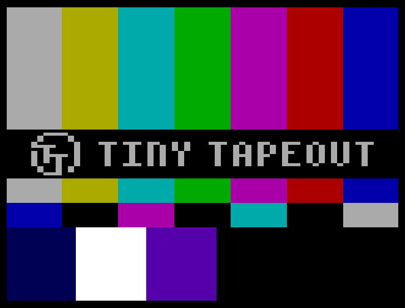

## How it works

Displays a test pattern on the screen resembling NTSC color bars.
Optionally, you can add a station ID, make the ID scroll, and make the color bars scroll.

The colors displayed are NOT accurate to actual NTSC color bars.
This cannot be used to adjust NTSC video equipment; it's just for fun.

## How to test

Connect to a VGA monitor. Set the following inputs to configure the design:
- `show_id` (`ui_in[0]`) to add a station ID,
- `custom_id` (`ui_in[1]`) to use a custom ID (address on `uio_out`, data on `ui_in[7:4]`),
- `scroll_id` (`ui_in[2]`) to make the ID scroll,
- `scroll_bars` (`ui_in[3]`) to make the color bars scroll.

## External hardware

[TinyVGA PMOD](https://github.com/mole99/tiny-vga)
