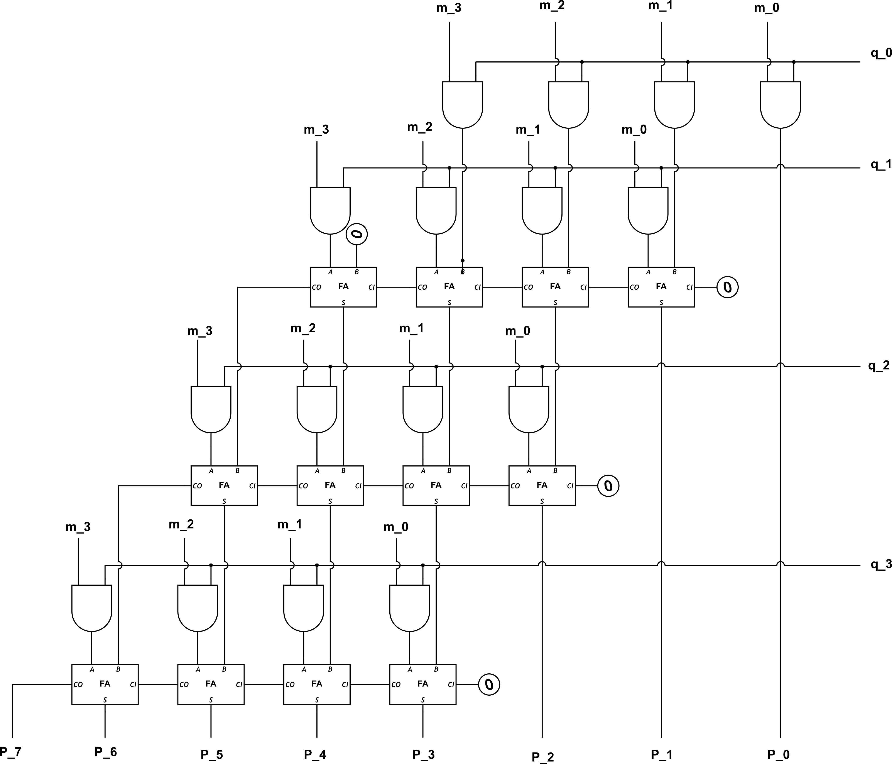

<!---

This file is used to generate your project datasheet. Please fill in the information below and delete any unused
sections.

You can also include images in this folder and reference them in the markdown. Each image must be less than
512 kb in size, and the combined size of all images must be less than 1 MB.
-->

## How it works

This project takes in two 4-bit inputs and multiplies them together into an 8-bit output. It uses an array of 12 full adders and 16 AND gates to do so (Figure 1). The operands are represented by the input pins with [0:3] representing operand 1 and [7:4] representing operand 2. The product is represented by the 8-bit output pin.

## How to test

Input two 4-bit numbers via ui_in. The 4 most significant bits are taken to be the first term, the 4 least significant bits are taken to be the second term. The 8 uo_out bits are the output, in binary. For example, an input of 10011101 would be (1001) * (1101), or 9 * 13. The product would be (01110101), or 117.

