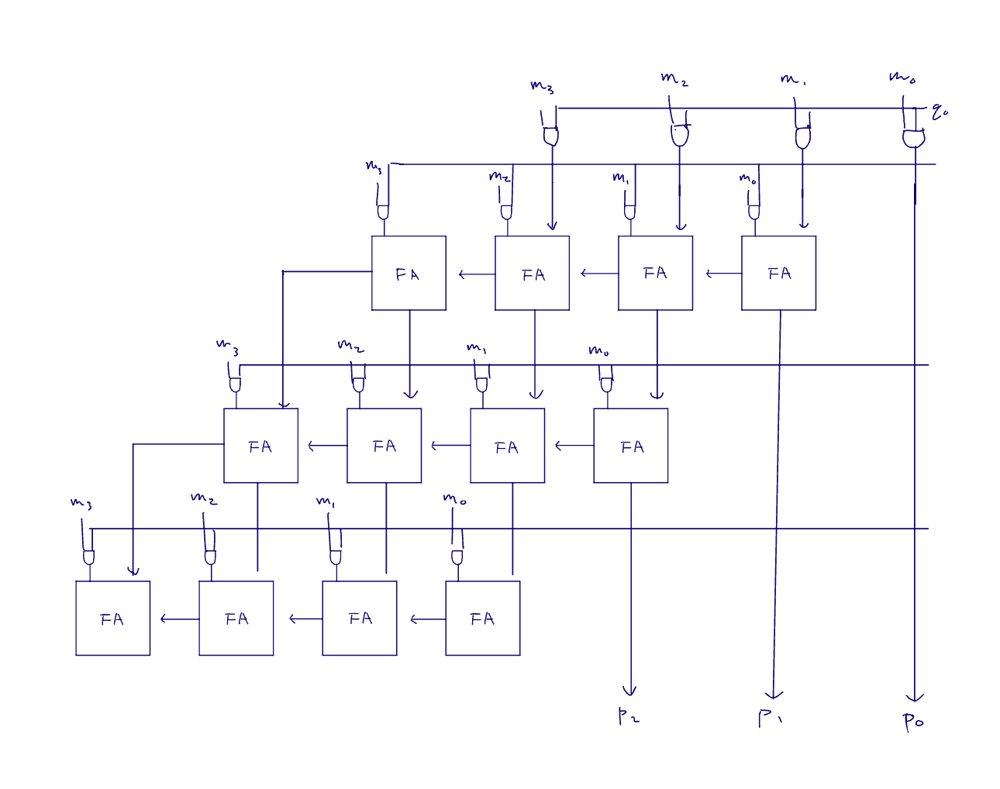

<!---

This file is used to generate your project datasheet. Please fill in the information below and delete any unused
sections.

You can also include images in this folder and reference them in the markdown. Each image must be less than
512 kb in size, and the combined size of all images must be less than 1 MB.
-->
## Array Multiplier

A 4-bit multiplier that outputs 8-bit result.
Author: Xiaoyu Guan, Andy Wu
        xg2523 cw4483
        Lab D 8

## How it works

Partial Product Generation:
The m and q inputs are both 4-bit binary numbers. To perform multiplication, partial products are generated by performing AND operations between each bit of m and each bit of q. These partial products are assigned to wires mp0, mp1, mp2, and mp3.

Summing Partial Products Using Full Adders:
The first row of partial products (mp0) is directly assigned to s0, representing the first sum. There is no carry-in for this row.
The partial products are added together using a series of full adders (full_adder module). A full adder takes three inputs: two data bits and a carry-in and outputs a sum and a carry-out.
The subsequent rows of partial products (mp1, mp2, and mp3) are added together row by row using the full adders, and the resulting sums and carry bits are propagated forward to the next stage.

Final Product:
After the partial products are added in the stages using the full adders, the final product is formed.
The final result, p, is an 8-bit number that represents the product of the 4-bit multiplicand and the 4-bit multiplier.

## How to test

The 8-bit input represents two 4_bit inputs, the 8-bit output should be the product(all unsigned binary numbers)
For example:
input:00010010
This means the input m=0001,q=0010. The operation is (in decimal) 1*2, result p=1*2=2. So output P should be 00000010.

## External hardware

N/A
