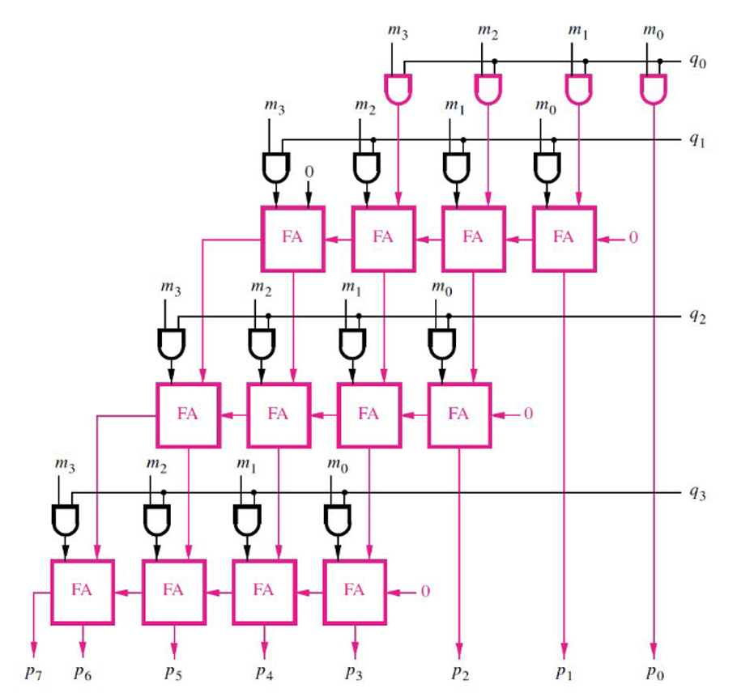
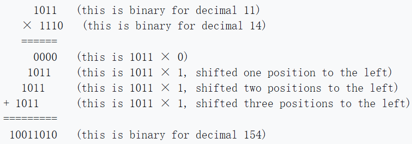

## How it works
4 by 4 Arrary Structural Multiplier
This is a class project designated to design a 4 by 4 arrary multiplier using logic gates and 1 bit full adders. Verilog codes were used in this projec t to implement this multiplier. The structural of the design is shown below.

The project fully implements this structure by replicating the logic gates and the connections to the repective components one by one. The adder module is included in the "project.v" file in the "src" folder. It is named as "black_box", because we used it for our first lab experiment and it was provided to us to see what it does and how it is implemented. The idea used in making this multiplier is partial product and adding together the products. This means that the product of each digits of the binary number is multiplied, shifted, and added with next line just like the way we did multiplication in decimal. Here is an example of binary product, and you can see how the idea of multipling (partial produuct), shifting, and adding is done.

For example:

The Credit of this picture to Wikipedia, and you can read more about this idea here: [Binary multiplier](https://en.wikipedia.org/wiki/Binary_multiplier)

This means that the multiplier support only unsigned binary numbers, so you should not expect to multiply signed decimal, 1's complemet, or 2's complement to work with this multiplier.
Overall, this is a simple 4 by 4 multiplier.

## How to test
To test if this project works, two ways are presented. The first way is to check the automatic test of the project, which is shown in the "Actions" bar. A green checkmark will show saying "test" if the project is working properly. You can modify the values of the tests by changing the "test.py" code. Here is how you can change to different values: Find the line that says "assert dut.uo_out.value", and change the value of the designated test value after the two equal sign. Then change the "dut.ui_in.value" value below the variable you just modified before this to the two binary numbers that you want to multiply. This variuable has eight bits, so that means the first 4 and last 4 bits each contributes to unsigned binary numbers respectively. Change this value so that when you calculate yourself, it matches with the valuee you entered above. The numbers you entered in "dut.uo_out.value" can be in decimal.

Another way to test this is to make the circuit for this structure according to the pictures provided and the codes in this project. You should get the same answer with the output of this project.

## External hardware
No External Hardware is used in this project, and it does not support external hardware for now.
