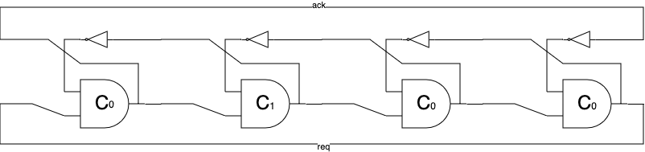

## How it works

(This is a variant of tt06-ncl-lfsr, but with different C-gate
implementations)

Muller's C-gate is a state-holding element with two inputs A and B,
and an output Q.  Q holds the previous state unless A == B in which
case it takes on this value.  There are many ways to implement the
C-gate.  In this design, we try two: building it from a latch and
building it out of combinatorial logic.  The two inputs ui[0] and
ui[1] are fed to two C-gates Cl and Cc, build with a latch and
combinatorial logic respectively.  Their respective outputs are wired
to uo[0] and uo[1].

We also build four rings from this, with uo[2] and uo[3] being the
output of a four stage build from Cl and Cc gates respectively.
Similar for uo[4]/uo[5] except using 16 stage rings and uo[6]/uo[7]
for 64 stage rings.

Since the pulse from each C-gate rings last only a few gate delay
times, we use it to feed a toggle flip-flop, thus the corresponding
output ping will toggle every time the pulse makes it round the ring.
In other words, the cycle time of 4, 16, and 64 stage ring
corresponding 8, 32, and 128 times the average stage delay of the
corresponding ring.

Why is this interesting?  Most asynchronous circuits disciplines rely
heavily on the Cgate and this stage delay represents the absolute
best-case for an asynchronous pipestage.  Of course, for most
interesting circuits the stage delay will be dominated by the
computation performed.

## How to test

Set ui[0] and ui[1] different values and verify that uo[0]/uo[1] only
changes when both agree.  The remaining six uo outputs corresponding
to six rings, two 4-stage, two 16-stage, and two 64-stage.  The first
of each pair are built from latches, the latter from combinatorial
logic.  It will be interesting to see which is faster.  The outputs
are limited to 33 MHz / 30.3 ns, thus if the stage delay is less 3.8
ns we likely will not observe anything.  For the other two the limits,
are 947 ps and 237 ps, respectively.  In hindsight, I should have made
the rings more than an order of magnitude longer.

## External hardware

For the basic test the rp2040 on the bringup board should be enough
for the ring test, an oscilloscope is definely required to see
anything from the rings.

