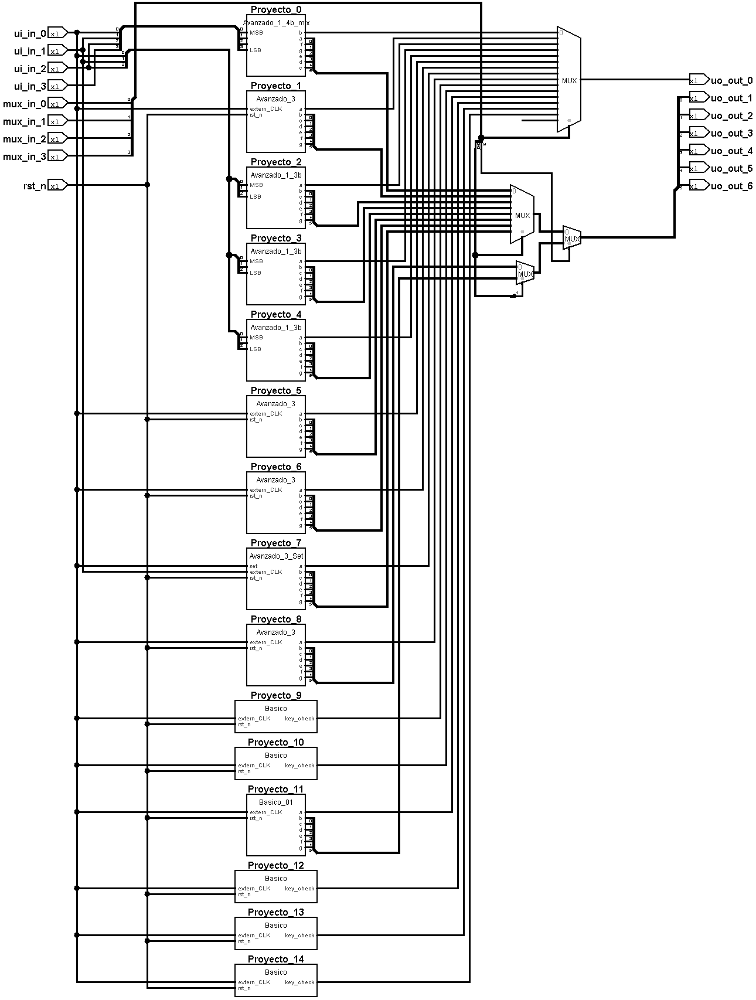

<!---

This file is used to generate your project datasheet. Please fill in the information below and delete any unused
sections.

You can also include images in this folder and reference them in the markdown. Each image must be less than
512 kb in size, and the combined size of all images must be less than 1 MB.
-->

## Summary

This project is a compilation of designs created by students with little to no knowledge in electronics, as a part of a hands-on learning course during * SEMANA UCU* , with their outputs multiplexed so we can test all. There were 15 total projects submitted, based on 3 different guidelines. Select the project using mux_in[0:3].

## Guidelines 

### 1- Basic Project
* Description: A shift register with ui_in[0] as input and ui_in[1] as external clock. When the shift register contains a specific key chosen by the students, ui_out[0] is driven to 1.
* How to test: Connect ui_in[1] with an external clock  and insert the key via ui_in[1] form MSB to LSB

### 2- Advanced Project N°1
* Description: Decoder from 3 bits to 7 segment display with ui_in[2:0] as inputs. Some groups upped it to 4 bits
* How to test: Input a 3 bit number through ui_in[2:0] and check if the output lights up the correct number (Watch out, most groups made ui_in[0] be the MSB and ui_in[2] be the LSB of your input)

### 3- Advanced Project N°2
* Description: A 3 bit counter, driven by an external clock through ui_in[0], connected to the 3 bits to 7 segment display decoder from Advanced Project N°1. Once again some groups upped both the counter and the decoded to 4 bits.
* How to test: Connect ui_in[0] to an external clock and check if the 7 segment display lights up correctly.

## Projects (Ordered by mux value)

### Group 0
* Member(s): Locatelli, Roldós
* Wokwi: https://wokwi.com/projects/410732069226456065
* Guideline chosen for project: Advanced Project N°1
* Details: Uses 4 bits as input, and a common cathode display

### Group 1
* Member(s): Giacometti, Salvo, Varela
* Wokwi: https://wokwi.com/projects/410463015062285313
* Guideline chosen for project: Advanced Project N°2
* Details: Uses a common cathode display, and counts up to 10 and overflows.

### Group 2
* Member(s): Raposo
* Wokwi: https://wokwi.com/projects/410724169008053249
* Guideline chosen for project: Advanced Project N°1
* Details: Uses 3 bits as input, and a common cathode display

### Group 3
* Member(s): Bava, Perez
* Wokwi: https://wokwi.com/projects/410732939207035905
* Guideline chosen for project: Advanced Project N°1
* Details: Uses 3 bits as input, and a common cathode display

### Group 4
* Member(s): Firpo, Pursals
* Wokwi: https://wokwi.com/projects/410570046815176705
* Guideline chosen for project: Advanced Project N°1
* Details: Uses 3 bits as input, and a common cathode display

### Group 5
* Member(s): Martinez
* Wokwi: https://wokwi.com/projects/410640428205329409
* Guideline chosen for project: Advanced Project N°2
* Details: Uses a common cathode display, and counts up to 8 and overflows.

### Group 6
* Member(s): Nasso, Juarez
* Wokwi: https://wokwi.com/projects/410553650788005889
* Guideline chosen for project: Advanced Project N°2
* Details:Uses a common cathode display, and counts up to 16 and overflows. (Only displays correctly up to 9)

### Group 7
* Member(s): Lenzuen, Gauthier
* Wokwi: https://wokwi.com/projects/410463710171875329
* Guideline chosen for project: Advanced Project N°2
* Details:Uses a common anode display, and counts up to 8 and overflows. In this case, clock is driven by ui_in[1], and ui_in[0] sets the counter to 7

### Group 8
* Member(s): Mendez, Vago
* Wokwi: https://wokwi.com/projects/410463176068023297
* Guideline chosen for project: Advanced Project N°2
* Details:Uses a common cathode display, and counts up to 16 and overflows. (Only displays correctly up to 9)

### Group 9
* Member(s): Albín
* Wokwi: https://wokwi.com/projects/410462842465590273
* Guideline chosen for project: Basic Project
* Details: Key is 0x11

### Group 10
* Member(s): Muniz
* Wokwi: https://wokwi.com/projects/410463191701250049
* Guideline chosen for project: Basic Project
* Details: Key is 0xB2

### Group 11
* Member(s): Cerizola, Mesa
* Wokwi: https://wokwi.com/projects/410555856765101057
* Guideline chosen for project: Basic Project
* Details: Key is 0x80

### Group 12
* Member(s): Romano, Ventós 
* Wokwi: https://wokwi.com/projects/410463349567547393 
* Guideline chosen for project: Basic Project
* Details: Both 0x7F and 0xFF work as key

### Group 13
* Member(s): Locatelli, Roldós
* Wokwi: https://wokwi.com/projects/410639448686247937 
* Guideline chosen for project: Basic Project
* Details: Key is 0x49

### Group 14
* Member(s): Hernández, Pedron
* Wokwi: https://wokwi.com/projects/410643958389030913  
* Guideline chosen for project: Basic Project
* Details: Key is 0x55
  
## Schematic
  

## External hardware

7 segment displays (common anode and common cathode)
LEDs

