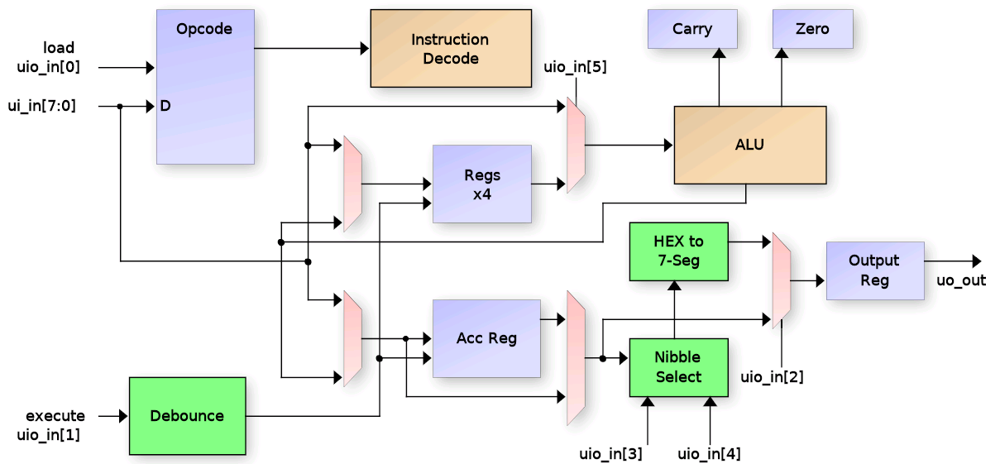

<!---

This file is used to generate your project datasheet. Please fill in the information below and delete any unused
sections.

You can also include images in this folder and reference them in the markdown. Each image must be less than
512 kb in size, and the combined size of all images must be less than 1 MB.
-->

## What is WocProc Trainer?

WocProc Trainer is a partial CPU implementation coded entirely in Wokwi!  While it is
not a fully functional CPU capable of fetching instructions and running code,
it does provide the ALU, registers and opcode deocde for performaing CPU operations
when you "feed" it instructions.  Turning it into a full CPU would
require addition of a Program Counter (PC), execution state machine, flow control
opcodes (jump, call, return, conditional branches, etc.), and an interface for fetching
opcodes.

## How it works

It works by "feeding" it opcodes and data via the ui[7:0] and ui[0] input pins and then executing them by toggling the uio[1] input pin.  Some instructions require additional "Immediate Data" to be supplied
via the ui[7:0] input pins prioro to toggling the uio[1] "execute" input.

The WokProc has an 8-bit accumulator and 4 8-bit working registers and can perform ADD, SUBTRACT and the standard logical functions AND,OR,XOR and NOT, as well as shift left/right operations.  It also keeps track of CARRY and ZERO bits to reflect the results of operations.

## How to test

  1. Provide a 10KHz clock then issue rst_n pulse.  
  2. Select the desired output mode for viewing results.  For this testing, set uio_in[5:2] all LOW.
     
     uio_in[2]: Selects 7-Segment (LOW) or binary (HIGH) output format
     uio_in[4]: Selects auto nibble / digit display (LOW) or manual (HIGH)
     uio_in[3]: Manual digit select when uio_in[4] is HIGH. 
     uio_in[5]: Selects value to output (LOW = ACC reg, HIGH = new ACC load value) 

  3.  Monitor the results using the 7-Seg display and uio_out[7:6] bits:

     uio_out[6]: Indicates if CARRY bit is set
     uio_out[7]: Indicates if ZERO bit is set

  4.  Perform an addition.  After reset, the opcode register contains opcode 0x00, which is A = A + IMM.  So supply a binry input value
      on ui_in[7:0] and toggle the EXECUTE input (uio_in[1]) HIGH then LOW.  The 7-Seg display should display the HEX value of the sum.

  5.  The first addition just looked like a 'load' since Acc was zero from the reset.  Add the value a second time (or supply a different
      value on ui_in[7:0]) and toggle the EXECUTE input again.  The 7-Segment display should show the result of the addiiton.

  6.  Load register r0 from the A register.  First enter the opcode (7'b1100_0000 from the opcode table) and then toggle the LOAD
      (ui_in[0]) input HIGH then LOW to load ui_in[7:] to the opcode register.  Now toggle the EXECUTE (ui_in[1]) input HIGH then LOW.
      Register r0 should now contain the value from A.

  7.  Test if register r0 was loaded.  First clear the Acc register (load opcode 7'b0111_0000 and EXECUTE it).  The 7-Seg should show "00.".
      Now load and execute the opcode to load register r0 to Acc (opcode 7'b0110_0000).  The 7-Seg should show the result of the summation
      that was stored in r0.

  8.  Perform a NOT operation on the A register by loading and executing opcode 7'0111_0001.  The 7-Seg should show the compliment
      value of what was in A.

  9.  Try additional oerations from the opcode table by loading and executing them.  For any opcode that uses IMM data,
      uio_in[7:0] inputs must be changed to the immediate data AFTER loading the opcode but BEFORE executing it.

## Opcodes supported:

 | Opcode    | Operation                | Description                      |
 | --------- | ------------------------ | -------------------------------- |
 | 0000_0000 | A <= A + IMM             | Add A + immediate data           |
 | 0000_1000 | A <= A + IMM + Carry     | Add with carry A + immediate     |
 | 0001_0000 | A <= A - IMM             | Subtract immediate from A        |
 | 0001_1000 | A <= A - IMM - Borrow    | Subtract with borrow immediate   |
 | 0010_00rr | A <= A + R[1:0]          | Add register rr to A             |
 | 0010_10rr | A <= A + R[1:0] + Carry  | Add with carry register rr       |
 | 0011_00rr | A <= A - R[1:0]          | Subtract register rr from A      |
 | 0011_10rr | A <= A - R[1:0] - Borrow | Subtract with borrow register rr |
 | 0100_0000 | A <= IMM                 | Load A with immediate data       |
 | 0110_00rr | A <= R[1:0]              | Load A from register rr          |
 | 0110_01rr | A <= A ^ R[1:0]          | XOR A with register rr           |
 | 0110_10rr | A <= A OR R[1:0]         | OR A with register rr            |
 | 0110_11rr | A <= A & R[1:0]          | AND A with register rr           |
 | 0111_0000 | A <= Zero                | Clear A                          |
 | 0111_0001 | A <= !A                  | Invert (1's compliment) A`       |
 | 0111_01rr | A <= !R[1:0]             | Load A from rr compliment        |
 | 0111_1000 | Cy <= 0                  | Clear the carry flag             |
 | 0111_1001 | Cy <= !Cy                | Compliment the carry flag        |
 | 0111_1010 | {A, Cy} <= {Cy, A}       | Shift right A through Carry      |
 | 0111_1011 | {Cy, A} <= {A, Cy}       | Shift left A through Carry       |
 | 0111_1100 | A <= {0, A[7:1]}         | Shift right A                    |
 | 0111_1101 | A <= {A[6:0], 0}         | Shift left A                     |
 | 0111_1110 | A <= {A[7], A[7:1]}      | Signed shift right A             |
 | 1000_00rr | R[1:0] <= A + IMM        | Load register rr with sum        |
 | 1001_00rr | R[1:0] <= A - IMM        | Load register rr with difference |
 | 1010_00rr | R[1:0] <= A + R[1:0]     | Load register rr with sum        |
 | 1011_00rr | R[1:0] <= A - R[1:0]     | Load register rr with difference |
 | 1100_00rr | R[1:0] <= IMM            | Load immediate data to rr        |
 | 1101_00rr | R[1:0] <= A              | Load A to rr                     |
 | 1110_RRrr | R[1:0] <= R[3:2]         | Copy register RR to rr           |

## Hardware needed:

Dip switches and 7-Segment LED.

