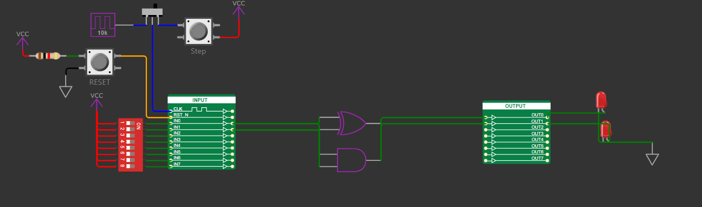
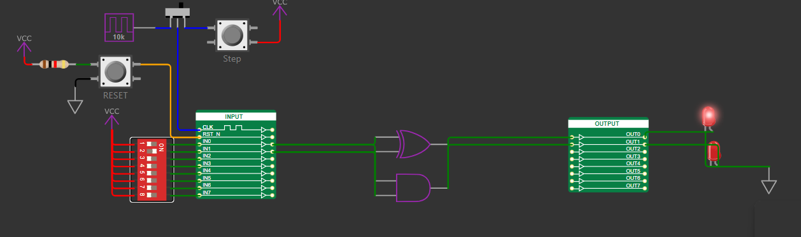
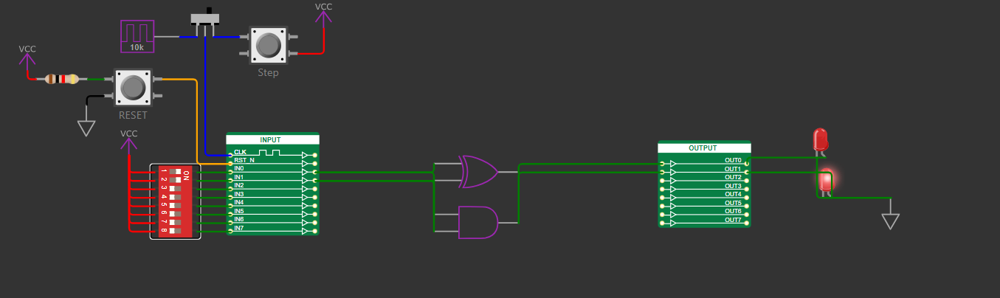

<!---

This file is used to generate your project datasheet. Please fill in the information below and delete any unused
sections.

You can also include images in this folder and reference them in the markdown. Each image must be less than
512 kb in size, and the combined size of all images must be less than 1 MB.
-->

## How it works

A Half adder is used to perform a single bit addition where the sum and carry is displayed in the output. 

The sum of the adder is given by XORing the inputs A and B.

The carry of the adder is given by performing an AND operation between A and B.

## How to test

Half adder can be tested and expressed by:

Sum (S) = A XOR B

Carry (C) = A . B

| A | B | S | C |
| :- | :- | :- | :- |
| 0 | 0 | 0 | 0 |
| 0 | 1 | 1 | 0 |
| 1 | 0 | 1 | 0 |
| 1 | 1 | 0 | 1 |
Table: Truth table for the half adder

## External hardware

Two LED bulbs are connected at the output of sum and carry. The LED will blink when the respective values are high.

